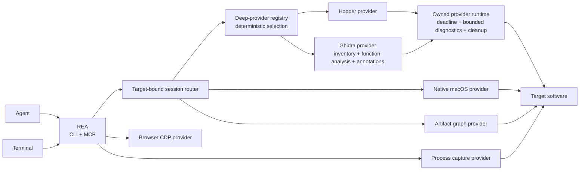

<div align="center">

**English** · [简体中文](README_zh.md) · [日本語](README_ja.md) · [한국어](README_ko.md) · [العربية](README_ar.md)

# REA: Reverse Engineer Anything

### Reverse engineer anything with agents, from app behavior down to native binaries.

**See a feature you like. Understand how it works, down to the binary level.**

[](https://www.npmjs.com/package/rea-agents)
[](https://github.com/morluto/rea/actions/workflows/ci.yml)
[](#tool-catalog-for-investigation)
[](https://nodejs.org/)
[](LICENSE)
[](https://discord.gg/GkcryMnJDM)

<a href="https://trendshift.io/repositories/82054?utm_source=trendshift-badge&amp;utm_medium=badge&amp;utm_campaign=badge-trendshift-82054" target="_blank" rel="noopener noreferrer"></a>

[Quick start](#quick-start) · [Current status](#current-status) · [Investigation model](#the-investigation-model) · [Tool catalog](#tool-catalog-for-investigation) · [Roadmap](#roadmap) · [How it works](#how-it-works)

<code>npx rea-agents setup</code>

<br />


<br />

<table aria-label="REA community">
<tr>
<td align="center" width="360">
  <a href="https://discord.gg/GkcryMnJDM">
    <br />
    <strong>Join the Reverse Engineering Community</strong>
  </a><br />
  <sub>Discord · Q&amp;A · Show and Tell</sub>
</td>
</tr>
</table>

<br />

</div>

---

See a feature in an app that you want in your own product? Ask your agent to investigate it with REA. It can inspect the app without its source code, explain how the feature works, show the evidence, and build a version for your project.

REA connects your agent to tools for inspecting native binaries, JavaScript and Electron apps, .NET assemblies, and websites. You can also use the same tools from your terminal. Analysis runs locally, and results include the evidence and limitations behind each conclusion.

Setup configures your agent and connects it to Hopper or Ghidra. If you need an analysis tool, setup can install Hopper for you.

## Just ask your agent

After [setup](#quick-start), restart your agent and ask:

```text
Understand how search works in the Notes app, show me the evidence, and build a
similar feature for my project.
```

Replace Notes with the app you want to understand, or ask for an overview first.

## The investigation model

<table>
<tr>
<td width="33%" valign="top">
<strong>Decompile</strong><br /><br />
Open an app and recover readable code, strings, names, and other clues about how it works.
</td>
<td width="33%" valign="top">
<strong>Understand</strong><br /><br />
Follow the code from one part of the app to another until the agent can explain how a feature actually works.
</td>
<td width="33%" valign="top">
<strong>Recreate</strong><br /><br />
Turn what the agent learned into a feature for your own product, adapted to your stack, interface, and requirements.
</td>
</tr>
</table>

REA shows how it reached its conclusions. It does not claim to recover original source code or automatically clone an application.

## Why REA

|                          |                                                                                                       |
| ------------------------ | ----------------------------------------------------------------------------------------------------- |
| **Built for agents**     | Ask what an app does and let your agent inspect it instead of guessing.                               |
| **CLI and MCP**          | Run the same reverse-engineering capabilities from your terminal or agent.                            |
| **Guided setup**         | Configure your agent, connect an existing analysis tool, or install Hopper with your approval.        |
| **From insight to code** | Understand a feature, then build your own version in the same coding session.                         |
| **Local by design**      | Analysis runs on your supported local host. REA does not upload the app to a hosted analysis service. |
| **Keeps context**        | Investigate several apps without starting over for every question.                                    |

## Quick start

### Run setup (recommended)

Set up REA with your agent:

```bash
npx rea-agents setup
```

Choose which supported agents should use REA, then review the exact paths and changes before approving. Existing REA registrations are selected by default; newly detected agents are available to select, but detection alone does not select them. Setup adds MCP access and REA's guided workflow for selected agents. Hopper is a separate optional choice with its own consent. Setup can also record an existing Ghidra installation.

Setup shows its changes before applying them and backs up existing configuration. See [Installation and setup](docs/installation.md) for requirements and setup options.

### With an agent (recommended)

After setup, restart your agent and [describe the app or feature](#just-ask-your-agent) you want to understand. Hopper can run in demo mode; if it shows a first-run prompt, choose the demo or enter an existing license.

REA supports Claude Code, Claude Desktop, Codex, Cursor, Gemini CLI, Windsurf, Devin, OpenCode, Antigravity, GitHub Copilot CLI, Command Code, and VS Code. Existing REA registrations are selected by default during setup; other detected agents remain unselected until chosen. Other agents can use the [manual MCP configuration](#manual-mcp-configuration).

### From the terminal with npx

After setup, run:

```bash
npx -y rea-agents@latest doctor
npx -y rea-agents@latest analyze /Applications/Notes.app
```

### Install the rea command

Install the command-line interface:

```bash
curl -fsSL https://raw.githubusercontent.com/morluto/rea/main/install.sh | bash
```

The installer adds `rea` to your system and starts setup when run in a terminal. It requires Node.js and npm to be installed already.

Alternatively, install with npm, then run setup:

```bash
npm install --global rea-agents
rea setup
```

Update either installation with `rea update`.

### Requirements

- macOS 12 or newer
- Ubuntu 24.04+, Fedora 41+, or 64-bit Arch Linux
- Node.js 22.x (>=22.19), 24.x (>=24.11), or 26+
- npm; REA does not require or install a particular npm version

Native binary analysis requires [Hopper](https://www.hopperapp.com/) or [Ghidra](#ghidra-analysis-provider). Hopper is separate software with its own license; its demo supports analysis with vendor-defined limits. REA can use Ghidra that you have already installed.

Windows Ghidra support is experimental for native x86-64 PE applications on local NTFS. The package bundles native Job Object, private-DACL, and path-admission controls. See [Windows Ghidra P0](docs/windows-ghidra-p0.md) for prerequisites and verified scope.

If something is not working, run:

```bash
npx -y rea-agents@latest doctor
```

`doctor` checks your host, dependencies, analysis tools, and agent configuration without changing them. Use `--json` for structured diagnostics.

### Linux installation and troubleshooting

On macOS, setup can install Hopper in `~/Applications` after approval. It verifies the official download and does not need Homebrew or administrator privileges.

On supported Linux distributions, setup can install Hopper and its demo-session dependencies through your system package manager. You may see a system authorization prompt. Demo sessions use a private virtual display, leaving your desktop alone. See [Hopper installation](docs/installation.md#hopper) for download verification and platform details.

The normal Linux launcher is `/opt/hopper/bin/Hopper`. If Hopper was installed elsewhere:

```bash
export HOPPER_LAUNCHER_PATH=/absolute/path/to/Hopper
rea doctor --json
```

If doctor reports a missing analysis engine even though the file exists, inspect shared-library resolution with:

```bash
ldd /opt/hopper/bin/Hopper | grep 'not found'
```

Install the missing packages and rerun `rea setup`. The Linux demo needs Xvfb, Python 3, X11, and XTEST; approved setup installs these dependencies. If you use the curl installer, add `~/.local/bin` to your shell `PATH` when needed.

REA defaults `HOPPER_LAUNCHER_PATH` to `/Applications/Hopper Disassembler.app/Contents/MacOS/hopper` on macOS and `/opt/hopper/bin/Hopper` on Linux. Explicit configuration always takes precedence.

### Ghidra analysis provider

Already use Ghidra? REA can connect it to your agent on Linux x64 or macOS x64/arm64. It requires **Ghidra 12.1.4** and a **64-bit JDK 21**. On macOS, your Ghidra installation must also include the native decompiler for your architecture.

Set the installation paths, then run setup:

```bash
export GHIDRA_INSTALL_DIR=/absolute/path/to/ghidra_12.1.4_PUBLIC
export JAVA_HOME=/absolute/path/to/jdk-21 # optional when java and javac resolve from PATH
rea doctor --json
rea setup
rea providers --json
```

Setup checks the installations and saves their paths in your selected agents' configuration after approval. Ghidra and Java must already be installed; REA does not download or change them.

The adapter exposes inventory, function, memory and load-image inspection, plus atomic function annotation edits on Linux and macOS. `annotate_native_function` edits names and entry comments in the session database and returns a refreshed function dossier; executable bytes stay unchanged. Ghidra does not provide GUI controls through REA.

REA analyzes a temporary copy of the target and removes the temporary project when the session closes. Results identify what Ghidra observed and what it could not resolve. Decompilation produces pseudocode rather than the original source.

Ghidra also imports DOS MZ executables with an explicit 16-bit x86 real-mode profile. Function results include complete observed body ranges, distinguishing owned bytes from the enclosing span. See the [DOS analysis guide](docs/ghidra-dos.md) for addresses, packing, and verification boundaries.

Windows Ghidra P0 uses bundled native controls for its read-only native x86-64 PE boundary on local NTFS; see the [Windows Ghidra P0 guide](docs/windows-ghidra-p0.md). See [Ghidra installation](docs/installation.md#ghidra), [provider evaluation](docs/provider-evaluation.md), and [testing](docs/testing.md) for configuration details, coverage, and real-provider verification.

To remove only REA-owned MCP registrations and the managed skill:

```bash
rea uninstall
rea uninstall --purge-data # also removes only ~/.rea/cache and ~/.rea/state
```

Uninstall preserves Hopper, Node.js, Evidence files, captures, unrelated skills, and other MCP servers. It refuses malformed client configuration and never follows purge-data symlinks.

### CLI or agent?

| If you want to…                                                  | Use                                                                 |
| ---------------------------------------------------------------- | ------------------------------------------------------------------- |
| Ask an agent to investigate an app and build a feature           | Run setup, restart your agent, then describe the task               |
| Inspect or decompile one part of an app from the Terminal        | `rea analyze` or `rea decompile`                                    |
| Validate, canonicalize, or compare Evidence bundles              | `rea evidence-import`, `rea evidence-export`, or `rea compare`      |
| Map a local JavaScript/Electron application without executing it | `rea analyze PATH` or `rea analyze-javascript-application`          |
| Reuse immutable analysis results without relaunching a provider  | Pass `--snapshot /path/to/analysis.json` to a deep-analysis command |
| Import source as historical reference                            | `rea import-reference-source`                                       |
| Capture or compare controlled process behavior                   | `rea capture-process` or `rea compare-process-captures`             |

```bash
rea evidence-import /absolute/path/to/evidence/bundle.json
rea evidence-export /absolute/path/to/evidence/bundle.json /absolute/path/to/evidence/canonical.json
rea compare /absolute/path/to/evidence/left.json /absolute/path/to/evidence/right.json
```

Analyze a JavaScript application directory or ASAR without executing it:

```bash
rea analyze /absolute/path/to/releases/app.asar --json
rea analyze-javascript-application /absolute/path/to/releases/app.asar --json
```

For a directory or `.asar`, generic `rea analyze` automatically selects the
static JavaScript application provider when neither `--provider` nor
`--snapshot` is supplied. Both routes return the analysis and its Evidence
context inline.

Import an older source tree as a reference. REA keeps it separate from observations of the current app:

```bash
rea import-reference-source /absolute/path/to/source
```

Imports read the path supplied to the command. File names do not cause automatic omissions; files are represented by hashes and metadata. To exclude selected paths, set `REA_REFERENCE_SECRET_PATTERNS_JSON` to a JSON string array of ignore patterns. Exports never replace an existing file unless `--overwrite` is explicit.

Use a snapshot to save successful analysis results and reuse them on later runs. REA reuses a result only when the target bytes, operation, parameters, analysis tool, and settings match. It does not cache changes or cursor-dependent calls. Snapshot files stay local and use owner-only permissions.

```bash
rea analyze /absolute/path/to/app --snapshot /absolute/path/to/analysis/app.json
# The same exact query can be answered from that snapshot.
rea analyze /absolute/path/to/app --snapshot /absolute/path/to/analysis/app.json
```

Exact CLI cached-evidence reads happen before any provider process starts. In MCP sessions,
pass `snapshot_path` to `open_binary` to import a snapshot atomically while
opening its matching target; MCP providers may still start before a cached call
result is returned. Pass `snapshot_path` and, when required, `overwrite: true` to
`close_binary` to save atomically before Hopper resources are released. If the
save fails, REA deliberately leaves the session open.

## One prompt, a full investigation

```text
Reverse engineer the Notes app. Find how offline search works, explain it,
and build a version for my project using TypeScript and SQLite.
```

REA gives the agent a clear path from that request to working code:

| Step | What the agent does                     | REA tools                                                        |
| ---: | --------------------------------------- | ---------------------------------------------------------------- |
|    1 | Opens and identifies the binary         | `open_binary`, `binary_overview`                                 |
|    2 | Finds likely offline-search clues       | `search_strings`, `search_procedures`, `list_names`              |
|    3 | Connects those clues to executable code | `find_xrefs_to_name`, `xrefs`, `procedure_callers`               |
|    4 | Reconstructs the relevant control flow  | `get_call_graph`, `procedure_callees`, `procedure_info`          |
|    5 | Decompiles the relevant routines        | `procedure_pseudo_code`, `procedure_assembly`, `batch_decompile` |
|    6 | Builds the feature in your project      | code adapted to your stack, product, and requirements            |

REA handles the app analysis in steps 1 through 5. The agent performs step 6 with its normal file-editing and test tools, using what it learned about the app.

## What agents can do

- Investigate a feature you like and build a version tailored to your own product.
- Explain how a feature works when its source code is unavailable.
- Reconstruct an app's authentication, storage, update, or networking flow.
- Recover enough structure to document an undocumented format or interface.
- Trace a suspicious behavior from a string or symbol to the code that implements it.
- Turn recovered behavior into product features, tests, migration notes, ports, or interoperable replacements.
- Analyze Swift and Objective-C metadata without manually untangling every mangled symbol.
- Leave names, comments, and bookmarks in Hopper so human and agent analysis reinforce each other.

See [native investigation](docs/native-investigation.md) for keyed archives, instruction/call/type primitives, typed dispatch metadata, value traces and native desktop observation.

## Tool catalog for investigation

| Tool family               | Count | Examples                                                                                                                                                  |
| ------------------------- | ----: | --------------------------------------------------------------------------------------------------------------------------------------------------------- |
| Native inspection         |    41 | functions, pseudocode, assembly, strings, symbols, calls, references, annotations, byte reads, and file offsets                                           |
| Investigation workflows   |    14 | app overviews, function dossiers, native APIs and dispatch, batch decompilation, feature traces, call paths, call graphs, Swift and Objective-C discovery |
| Native macOS utilities    |     7 | Mach-O metadata, code signatures, plists, architectures, and Swift demangling without launching Hopper                                                    |
| Artifact graph            |     5 | directory and package inventories, compiled Interface Builder files, Apple asset catalogs, and extraction                                                 |
| Managed PE/CLI            |     7 | .NET identity, metadata, CIL instructions, native dependencies, reconstruction imports, and build comparisons                                             |
| Browser observation       |     9 | page structure, network metadata, scripts, source maps, WebMCP discovery, screenshots, and capture comparisons                                            |
| Electron analysis         |     5 | renderer observation, static app mapping, and static/runtime reconciliation                                                                               |
| JavaScript runtime        |     2 | Node/Electron Inspector target discovery, script locations, and execution-context events                                                                  |
| Application workflows     |     7 | cross-layer feature traces, build comparisons, historical source mapping, static return-shape comparison, and reconstruction checks                       |
| Workspace and observation |    21 | sessions, evidence bundles, navigation context, process/artifact/function comparisons, and open-question tracking                                         |

The public interface describes what the agent is trying to learn. Providers decide how to answer. macOS utilities handle common semantic inspection without launching Hopper; Hopper handles deeper native analysis; the process harness records direct behavioral captures.

## Current status

REA supports native application, JavaScript, Electron, .NET, and browser investigation on macOS and Linux. Individual tools have platform and runtime prerequisites; use `rea capabilities` to check what is available on your host.

- **Native binaries:** Open Mach-O, ELF, PE, and Mac `.app` targets through Hopper or Ghidra. Inspect functions, strings, assembly, decompilation, calls, and references. Hopper also accepts `.hop` databases and supports annotations.
- **Packages and resources:** Inspect directories, ZIP, APK, IPA, ASAR, plists, compiled Interface Builder files, and Apple asset catalogs. Artifact requests name the input and requested extraction or traversal directly; macOS DMG traversal also requires the host's native mounting support.
- **JavaScript and Electron:** Map modules, imports, source maps, routes, IPC channels, storage, and native add-ons without running the app. Compare builds and trace a feature across the recovered graph. Dynamic and ambiguous relationships remain unresolved. See [JavaScript application workflows](docs/javascript-application-workflows.md).
- **Websites:** Inspect a selected page in an existing Chrome-family browser. Capture page structure, network metadata, script evidence, and screenshots requested by the call. Passive observation does not navigate or execute page JavaScript. See [browser observation](docs/browser-observation.md).
- **Electron and Node runtime observation:** Inspect selected Electron pages or attach to a Node/Electron V8 Inspector target. Inspector observation records script locations and execution-context events; it does not infer imports, IPC activity, or which modules executed. See [runtime observation](docs/javascript-runtime-observation.md).
- **.NET assemblies:** Inspect metadata and CIL instructions, compare builds, and check declared native dependencies without loading or running the assembly. Imported decompiler output is labeled as analyst inference. See [managed-code analysis](docs/managed-code-analysis.md).
- **Controlled behavior capture:** Run process, browser, or Electron scenarios with the target, actions, and lifecycle declared in each request, then compare the resulting evidence. Missing observations cannot establish that two runs behaved the same way.
- **Evidence and comparison:** Save results with artifact identity, provider, locations, confidence, and limitations. Export or import bundles, compare artifacts and functions, and connect static findings to runtime observations without claiming causality from correlation.
- **Open questions:** Track unresolved findings, contradictions, and follow-up probes. Reconstruction checks report pass, fail, or unknown rather than treating missing evidence as a pass.
- **Guided workflows:** Start six [MCP investigation workflows](docs/mcp-prompts.md) with suggestions based on your current session.

Windows Ghidra P0 supports the read-only native x86-64 PE boundary on local NTFS. Hopper-only features, such as GUI controls and annotations, are not available through Ghidra.

### Website observation with CDP

REA can inspect an already-running Chrome-family browser through a literal loopback CDP endpoint. Each request names the endpoint and target; an optional origin filter can narrow discovery:

```bash
rea list-browser-targets http://127.0.0.1:9222 --json
rea inspect-web-page http://127.0.0.1:9222 TARGET_ID --json
```

The eight passive browser tools work through both CLI and MCP. They inspect the selected page without navigating, clicking, or evaluating its JavaScript. Credentials, cookies, authorization headers, and raw payload values are not retained. A request selects whether to include script sources, accessibility text, screenshots, or console and payload summaries. REA cannot observe activity that happened before it attached. See [browser observation](docs/browser-observation.md) for browser startup, capture options, and limits.

### Controlled browser scenarios

`capture_browser_scenario` runs a caller-declared sequence of browser actions through
Playwright. Unlike passive observation, it can interact with the page. Each
step records evidence such as screenshots, page structure, navigation, and
network activity. Missing or truncated observations cannot establish that two
runs behaved the same way.

```bash
rea capture-browser-scenario ./scenario.json --json
```

Launch mode owns a temporary browser profile and removes it after terminating
the launched browser. Connect mode accepts one exact loopback CDP target and
disconnects without closing the external browser. The request supplies the
selected executable or endpoint, actions, and any origin or environment
selections needed by the scenario. Scenario JSON contains secret references and
environment-variable names, never secret values. See the
[browser scenario contract](docs/browser-scenario-contract.md).

### Node and Electron V8 Inspector observation

Node and Electron runtime observation attaches to an existing Inspector target named in the request:

```bash
rea list-javascript-runtime-targets http://127.0.0.1:9229 --json
rea observe-javascript-runtime http://127.0.0.1:9229 TARGET_ID \
  --runtime-kind node --json
```

REA records script locations and execution-context events without evaluating
code or setting breakpoints. These observations do not establish import
relationships, event activity, IPC, process identity, or Electron roles. See
[Node and Electron runtime observation](docs/javascript-runtime-observation.md)
for the exact coverage.

Exact package, tool-family, provider, setup-client, schema, and CLI facts are generated from source in [`docs/product-catalog.json`](docs/product-catalog.json). PR CI verifies this catalog, narrative documentation, and generated schemas.

## Roadmap

The [current status](#current-status) section describes shipped capabilities. These are the next areas of work.

### Now

1. **Keep documentation accurate:** update the generated catalog and documentation checks when tools, providers, setup options, or versions change.
2. **Test more native binaries:** expand architecture and indirect-call coverage across Hopper and Ghidra.

### Next

1. **Connect more application layers:** add static extractors and runtime observations to feature traces.
2. **Extend .NET analysis:** improve comparisons of obfuscated assemblies and connect managed findings to verified native analysis. See the [managed-code guide](docs/managed-code-analysis.md).
3. **Compare more runtime behavior:** expand process, protocol, filesystem, reconnect, and version-comparison coverage.

### Later

1. **Expand browser and Electron interaction:** add scenario actions beyond the current click and wait operations.
2. **Observe native apps at runtime:** explore LLDB, Frida, system logs, and native API tracing.
3. **Evaluate more tools and targets:** assess IDA/Hex-Rays, Binary Ninja, Rizin, LIEF, Windows-native tools, mobile apps, and firmware.

Setup already lets you choose agent integration and Hopper installation. Support for installing additional analysis tools is future work, described in the [installation roadmap](docs/roadmap.md).

See [provider evaluation](docs/provider-evaluation.md) for coverage and remaining requirements, and the [native investigation guide](docs/native-investigation.md) for UI, dispatch, and value-flow analysis.

## Using REA with other agents

Setup offers supported agent integrations for selection. Existing REA registrations are selected by default; newly detected agents remain unselected until chosen. Any agent that supports local MCP servers can use the configuration below.

### Manual MCP configuration

<!-- x-release-please-start-version -->

```json
{
  "mcpServers": {
    "rea": {
      "command": "npx",
      "args": ["-y", "rea-agents@4.1.0", "mcp"]
    }
  }
}
```

<!-- x-release-please-end -->

Persistent registrations should use one exact package version. `rea setup`
maintains that pin, updates the bundled skill at the same time, and gives Codex
a 30-second startup allowance for a cold package-runner start. `rea update`
installs an exact release and verifies the new executable. It returns an
unapplied maintenance plan for existing REA integrations, with a scoped setup
command to review and approve their changes. Restart affected agents afterward.

MCP clients that support prompts can also discover six ordered investigation
workflows through `prompts/list`. Their optional identifier arguments use the
current session for bounded `completion/complete` suggestions; see
[Guided MCP prompts and completion](docs/mcp-prompts.md).

## How it works



The CLI and MCP server use the same application workflows and evidence contracts. A provider declares which capabilities it supports and the side effects those capabilities may have. Terminal commands are short-lived; an MCP session can retain an active target and evidence ledger for the session.

## CLI

The agent workflow above is the easiest way to use REA. For a one-off overview from the Terminal:

```bash
npx -y rea-agents@latest analyze /Applications/Notes.app
npx -y rea-agents@latest inspect /Applications/Notes.app
npx -y rea-agents@latest search /Applications/Notes.app "offline"
npx -y rea-agents@latest function /Applications/Notes.app 0x1000
npx -y rea-agents@latest xrefs /Applications/Notes.app 0x1000
npx -y rea-agents@latest trace /Applications/Notes.app "offline"
npx -y rea-agents@latest compare /absolute/path/to/left-evidence.json /absolute/path/to/right-evidence.json
npx -y rea-agents@latest capabilities
npx -y rea-agents@latest providers
```

Run `npx -y rea-agents@latest --help` for direct decompilation, bounded search and
other options. `analyze` and `inspect` share the same overview workflow;
`function`, `xrefs`, and `trace` return the same Evidence envelopes as MCP.

Or install the `rea` command globally:

```bash
npm install --global rea-agents
rea --help
rea update
rea mcp
```

REA accepts a Mac `.app` folder directly. If an agent cannot find an app by name, tell it where the app is installed.

### Choosing a deep-analysis provider

Choose which analysis tool to use from the CLI:

```bash
rea providers --json
rea analyze /absolute/path/to/program --provider hopper
REA_ANALYSIS_PROVIDER=hopper rea decompile /absolute/path/to/program 0x1000
```

For MCP, pass the optional selector on `open_binary`:

```json
{
  "path": "/absolute/path/to/program",
  "provider_id": "hopper"
}
```

Use `--provider`, or `provider_id` in MCP, to choose Hopper or Ghidra for a target. This choice overrides `REA_ANALYSIS_PROVIDER`.

With `auto`, REA selects the only available tool that supports the target. If both are available, specify one before opening the target. The session keeps that choice until you explicitly switch or close it; a failure never silently switches tools. Artifact-only analysis can work without a native analysis tool.

Run `rea providers` and `rea capabilities` to check availability and supported operations. Ghidra supports inspection and atomic function annotation edits on Linux and macOS. Its database edits are discarded on close; GUI controls require Hopper. Windows Ghidra P0 supports read-only analysis of native x86-64 PE applications on local NTFS with bundled native controls.

The session also reports active work and cleanup status. If a caller times out, the analysis tool may still be busy; `analysis_activity` reports that state. A `cleanup_incomplete` result identifies resources whose shutdown or removal could not be verified. See [provider selection and analysis profiles](docs/adr/0001-provider-selection-and-analysis-profiles.md) for session, cache, and process-tracking details.

### CLI exit status

| Status    | Meaning                                                                                                                                                                        |
| --------- | ------------------------------------------------------------------------------------------------------------------------------------------------------------------------------ |
| `0`       | The operation completed. Results may still include warnings, partial evidence, or unresolved questions.                                                                        |
| `1`       | The operation could not complete, for example because of invalid input, host permission denial, cancellation, or timeout. Structured output reports the reason when available. |
| `128 + N` | The process ended from signal `N`, where the shell or runtime preserves the conventional signal-derived status.                                                                |

`setup --dry-run` returns status `planned` and exits `0`. A setup result with
status `cancelled` also exits `0`.
`setup` returns `1` for `needs_confirmation` or `needs_human`
because configuration is not ready; rerun it after approval or remediation.
`doctor` returns `1` when required checks for its readiness scope are unhealthy.
Unavailable optional provider prerequisites remain visible as informational
diagnostics and do not block setup or unrelated providers. Output format, full envelopes,
filters, and token controls never change the operation status.

When REA feeds a shell pipeline, enable `pipefail` so a downstream formatter
cannot hide its failure:

```bash
set -o pipefail
rea inspect-artifact ./app.asar --json | jq . > inspection.json
```

## Current Hopper provider

REA starts Hopper when an operation needs it. On macOS, Hopper may bring its window or a dialog to the foreground even though REA requests background startup. Demo or license prompts may need your attention.

Hopper handles one analysis request at a time. Cancelling your wait does not stop work already running inside Hopper; the session reports whether it is still busy. Successful decompilation results are cached until a relevant rename or comment change.

Use `rea instructions` when you only need assembly instructions for a function. It avoids decompilation and a whole-program inventory.

Closing a session shuts down REA's bridge and removes its temporary socket directory while preserving a Hopper application you may be using. If cleanup cannot be verified, `close_binary` reports `cleanup_incomplete` and the affected resources.

## Process capture

Process capture runs the exact executable and scenario declared in the request,
with the requested working directory and environment. Filesystem observation
paths select what to snapshot. The process runs with your user permissions;
Process Capture records behavior and is not a security sandbox.

Capture a scenario or compare two saved Process Capture Evidence records:

```bash
rea capture-process ./scenario.json > authority.json
rea capture-process ./reconstruction.json > reconstruction.json
rea compare-process-captures authority.json reconstruction.json
```

The comparison reports each observed dimension separately and identifies the
first terminal, interaction, exit, filesystem, or process divergence.
See [Process Capture](docs/process-capture.md) for scenario fields, limits, and
evidence boundaries.

REA installs a prebuilt PTY backend for supported macOS, Linux, and Windows
architectures. If the capability check reports that the backend is unavailable,
reinstall REA for the current platform and architecture.

ASAR inventory verifies Electron integrity metadata for both archive entries
and `.asar.unpacked` companion files. Integrity failures identify the logical
path, declared and calculated SHA-256 values, and whether the entry was
unpacked; REA does not silently accept the mismatched artifact. If a supplied
ASAR declares unpacked companion bytes that are absent from the local artifact
set, REA keeps that occurrence as `unavailable` and continues analyzing the
embedded JavaScript instead of treating the missing native/resource bytes as
verified or absent.

## Security model

Analysis runs locally. REA communicates with Hopper and Ghidra through authenticated private local sockets. Your agent or model provider has its own data policy.

Runtime requests act on the declared target and lifecycle. Analysis tools and launched targets run with your user permissions, and native UI capture still depends on macOS Accessibility and Screen Recording access. Static JavaScript analysis does not execute extracted modules; use direct browser, Electron, or process capture when runtime behavior is needed.

Windows Ghidra P0 automatically uses native Job Objects, protected private-runtime DACLs, and handle-based admission. Its experimental scope is native x86-64 PE applications on local NTFS. Report vulnerabilities through the private process in [SECURITY.md](SECURITY.md).

## FAQ

<details>
<summary><strong>Does Hopper need to be running before I start REA?</strong></summary>

No. REA starts Hopper when an operation needs it. An already-running Hopper application is also supported.

</details>

<details>
<summary><strong>Why did Hopper appear in front of my other windows?</strong></summary>

Hopper's launcher internally activates the application. REA requests background startup, but macOS and Hopper may still bring a window or dialog forward. See [Current Hopper provider](#current-hopper-provider).

</details>

<details>
<summary><strong>Does REA include Hopper?</strong></summary>

No. Setup can install Hopper for you, but Hopper remains separate software with its own license. REA supplies the CLI, MCP server, and workflows that make it usable by agents.

</details>

<details>
<summary><strong>Does REA install or include Ghidra or Java?</strong></summary>

No. REA connects to an existing Ghidra installation. Run setup after providing the Ghidra and Java paths shown in the [Ghidra section](#ghidra-analysis-provider).

</details>

<details>
<summary><strong>Does REA upload the app?</strong></summary>

REA has no hosted analysis service. Current providers analyze artifacts and capture behavior locally. Your agent or model provider may have its own data policy, so review that separately.

</details>

<details>
<summary><strong>Can REA recover the original source code?</strong></summary>

No decompiler can guarantee the original source. REA gives an agent pseudocode, assembly, symbols, strings, metadata, and relationships that it can use to explain or compatibly recreate observed behavior.

</details>

<details>
<summary><strong>Which agents can use REA?</strong></summary>

Any agent that can run a local MCP server can use the manual configuration. Setup offers the supported integrations listed in [Installation and setup](docs/installation.md#supported-agents); existing REA registrations are selected by default, and other detected agents require selection.

</details>

## Development

See [CONTRIBUTING.md](CONTRIBUTING.md) for development setup and contribution checks, and [docs/testing.md](docs/testing.md) for test scopes and real-tool verification. `npm run docs:check` checks committed generated documents; `npm run docs:generate` regenerates them.

`npm run verify:agent` evaluates native, JavaScript, managed, and browser investigation tasks through a real local Codex CLI. Its report covers tool selection, repeated calls, token use, completion quality, and handling of permissions and unknowns.

`npm run evidence:generate` regenerates the managed conformance manifest and Evidence completion ledger from live verification results. `npm run evidence:check` reruns verification and checks for drift. Unsupported claims remain explicit and do not count as passes. See [testing](docs/testing.md) for verification commands and process-cleanup checks.

## Project links

[npm](https://www.npmjs.com/package/rea-agents) · [Issues](https://github.com/morluto/rea/issues) · [Security](SECURITY.md) · [Contributing](CONTRIBUTING.md) · [Hopper](https://www.hopperapp.com/) · [Ghidra](https://github.com/NationalSecurityAgency/ghidra)

## License

[MIT](LICENSE)
