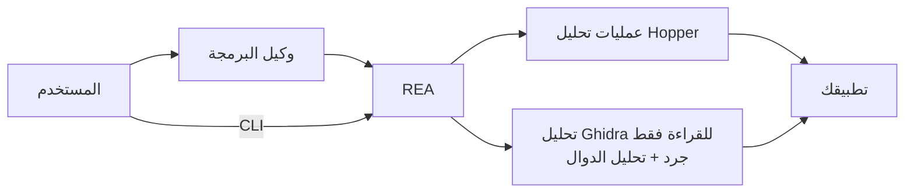

<div align="center">

[English](README.md) · [简体中文](README_zh.md) · [日本語](README_ja.md) · [한국어](README_ko.md) · **العربية**

# REA: هندسة أي شيء عكسيًا

### استقصِ سلوك التطبيقات والملفات التنفيذية الأصلية باستخدام وكيلك.

**اعثر على ميزة تعجبك. افهم آلية عملها. ابنها بالطريقة التي تريدها.**

[](https://www.npmjs.com/package/rea-agents)
[](https://github.com/morluto/rea/actions/workflows/ci.yml)
[](#منصة-أدوات-التحقيق)
[](https://nodejs.org/)
[](LICENSE)
[](https://discord.gg/GkcryMnJDM)

<a href="https://trendshift.io/repositories/82054?utm_source=trendshift-badge&amp;utm_medium=badge&amp;utm_campaign=badge-trendshift-82054" target="_blank" rel="noopener noreferrer"></a>

[البدء السريع](#البدء-السريع) · [حالة الدعم](#حالة-الدعم) · [من الملف التنفيذي إلى السلوك](#من-الملف-التنفيذي-إلى-السلوك) · [منصة أدوات التحقيق](#منصة-أدوات-التحقيق) · [خطة العمل](#خطة-العمل) · [كيف يعمل؟](#كيف-يعمل)

<table aria-label="REA community">
<tr>
<td align="center" width="360">
  <a href="https://discord.gg/GkcryMnJDM">
    <br />
    <strong>انضم إلى مجتمع الهندسة العكسية</strong>
  </a><br />
  <sub>Discord · أسئلة وأجوبة · شارك أعمالك</sub>
</td>
</tr>
</table>

<br />

<code>npx rea-agents setup</code>

<br />


</div>

---

هل وجدت في تطبيق ميزة تريدها في منتجك؟ اطلب من وكيلك استقصاءها باستخدام REA. يستطيع فحص التطبيق من دون شيفرته المصدرية، وشرح طريقة عمل الميزة وعرض الأدلة، ثم بناء نسخة تناسب مشروعك.

يوفر REA أدوات لتحليل الملفات التنفيذية الأصلية وتطبيقات JavaScript وElectron وتجميعات .NET والمواقع. يمكنك استخدامها من وكيلك أو من الطرفية. يعمل التحليل محليًا، وتتضمن النتائج الأدلة والقيود.

يضبط Setup إعدادات الوكيل ويربطه بتثبيت موجود من Hopper أو Ghidra. ويمكنه تثبيت Hopper بعد موافقتك.

## اطلب من وكيلك مباشرة

بعد [الإعداد](#البدء-السريع)، أعد تشغيل الوكيل ثم اطلب:

```text
استقصِ طريقة عمل البحث في تطبيق Notes، واعرض الأدلة، ثم ابنِ ميزة مشابهة لمشروعي.
```

استبدل Notes بالتطبيق الذي تريد فهمه، أو اطلب نظرة عامة أولًا.

## من الملف التنفيذي إلى السلوك

| فك الترجمة                                                       | الفهم                                                   | إعادة الإنشاء                                                 |
| ---------------------------------------------------------------- | ------------------------------------------------------- | ------------------------------------------------------------ |
| استخرج الشيفرة شبه المصدرية، والتعليمات، والسلاسل النصية، والرموز | تتبع تدفق التحكم والمراجع المتبادلة والاستدعاءات والأنواع | حوّل ما تعلمه الوكيل إلى ميزة تناسب تقنياتك وواجهتك ومتطلباتك |

يوضح REA كيف وصل إلى نتائجه. وهو لا يدّعي استعادة الشيفرة المصدرية الأصلية أو استنساخ التطبيق تلقائيًا.

## لماذا REA؟

|                      |                                                                                       |
| -------------------- | ------------------------------------------------------------------------------------- |
| **مصمم للوكلاء**      | اسأل عما يفعله تطبيق مترجم ودع الوكيل يجمع الأدلة بدلًا من التخمين.                      |
| **CLI وMCP**         | استخدم قدرات الهندسة العكسية نفسها من الطرفية أو وكيل البرمجة.                        |
| **يتولى التعقيد**    | يدير REA إعداد الأدوات وفتح التطبيق واستمرار الاستقصاء والتنظيف بعد الانتهاء.            |
| **سير عمل كامل**     | انتقل من النظرة الأولى إلى الشيفرة شبه المصدرية وعلاقات الاستدعاء والأنواع وأدلة التنفيذ. |
| **محلي حسب التصميم** | يجري التحليل على جهازك المدعوم ولا يرفع REA الملف التنفيذي إلى خدمة تحليل مستضافة.     |
| **يحافظ على السياق** | استقصِ عدة ملفات تنفيذية من دون بدء التحليل من جديد عند كل سؤال.                       |

## البدء السريع

### تشغيل الإعداد (موصى به)

اربط REA بوكيلك:

```bash
npx rea-agents setup
```

يعرض Setup أولاً قائمة متعددة الاختيار للوكلاء الذين تريد ربطهم. تكون تسجيلات REA الموجودة محددة افتراضياً، ولا يؤدي اكتشاف عميل جديد وحده إلى تحديده؛ ويمكنك اختيار عميل غير مهيأ. راجع المسارات والتغييرات المحددة قبل الموافقة. يثبت Setup سير عمل REA للوكلاء المحددين افتراضياً. Hopper خيار منفصل يتطلب موافقة مستقلة، ويمكن أيضاً حفظ مسارات تثبيت Ghidra الموجودة.

يعرض التغييرات قبل تطبيقها وينشئ نسخة احتياطية من الإعدادات الموجودة. راجع [دليل التثبيت والإعداد](docs/installation.md) للمتطلبات والخيارات الإضافية.

### الاستخدام مع وكيل

بعد الإعداد، أعد تشغيل الوكيل واشرح التطبيق أو الميزة التي تريد استقصاءها. يدعم REA Claude Code وClaude Desktop وCodex وCursor وGemini CLI وWindsurf وDevin وOpenCode وAntigravity وGitHub Copilot CLI وCommand Code وVS Code. تكون تسجيلات REA الموجودة محددة افتراضياً، ويجب اختيار العملاء المكتشفين الآخرين يدوياً. يمكن للوكلاء الآخرين استخدام إعداد MCP أدناه.

يمكن تشغيل Hopper في الوضع التجريبي. إذا ظهرت رسالة عند التشغيل الأول، فاختر التجربة أو أدخل ترخيصًا موجودًا.

### الاستخدام من الطرفية

بعد الإعداد، شغّل:

```bash
npx -y rea-agents@latest doctor
npx -y rea-agents@latest analyze /Applications/Notes.app
```

### تثبيت أمر rea

ثبت واجهة سطر الأوامر:

```bash
curl -fsSL https://raw.githubusercontent.com/morluto/rea/main/install.sh | bash
```

يجب تثبيت Node.js وnpm مسبقًا. عند تشغيله من طرفية، يثبت البرنامج `rea` ويبدأ الإعداد.

يمكنك بدلًا من ذلك التثبيت باستخدام npm ثم تشغيل الإعداد:

```bash
npm install --global rea-agents
rea setup
```

### المتطلبات

- macOS 12 أو أحدث
- Ubuntu 24.04+ أو Fedora 41+ أو Arch Linux بنواة 64 بت
- Node.js 22.x (>=22.19) أو 24.x (>=24.11) أو 26+ وnpm

يتطلب تحليل الملفات التنفيذية الأصلية Hopper أو Ghidra. Hopper برنامج منفصل، وللوضع التجريبي قيود يحددها المورّد، لكن الترخيص المدفوع ليس إلزاميًا.

يدعم Ghidra نظامي Linux x64 وmacOS x64/arm64. ثبت Ghidra 12.1.4 وJDK 21 الكامل بنواة 64 بت بصورة منفصلة، ثم اضبط REA لاستخدامهما. يحتاج macOS أيضًا إلى أداة فك الترجمة الأصلية المطابقة لمعمارية الجهاز.

يستطيع Setup التحقق من التثبيت وحفظ المسارات؛ ولا يثبت أو يحدّث Ghidra أو Java أو Node.js أو npm أو Homebrew.

تحليل Ghidra على Windows غير متاح. لم تُنفذ بعد ضوابط ملكية العمليات وأذونات المجلدات الخاصة والتحقق الآمن من المسارات. حتى التثبيت الصحيح لـ Ghidra وJava لا يفعّل التحليل. راجع [Windows Ghidra P0](docs/windows-ghidra-p0.md).

### تشخيص المشكلات

يشخّص `npx -y rea-agents@latest doctor` الجهاز والاعتماديات وأدوات التحليل وإعدادات الوكيل من دون تغييرها. أضف `--json` للحصول على تشخيص منظم.

مسار Hopper الافتراضي على Linux هو `/opt/hopper/bin/Hopper`. استخدم `HOPPER_LAUNCHER_PATH` للمسارات الأخرى. إذا كان الملف موجودًا لكن محرك التحليل لا يظهر، فشغّل `ldd /opt/hopper/bin/Hopper | grep 'not found'` للتحقق من المكتبات الناقصة. راجع [دليل Hopper](docs/installation.md#hopper).

### التحديث والإزالة

- يحدّث `rea update` تثبيت REA الحالي.
- يزيل `rea uninstall` تسجيلات الوكلاء وملفات سير العمل التي يديرها REA، ويترك Hopper مثبتًا.
- يزيل `rea uninstall --purge-data` أيضًا ذاكرة REA المؤقتة وحالته. استخدمه فقط إذا أردت حذف هذه البيانات.

## حالة الدعم

يوفر REA عبر CLI وMCP تحليل الملفات التنفيذية الأصلية وتطبيقات JavaScript وElectron وتجميعات .NET والمواقع. تعتمد العمليات المتاحة على الجهاز والهدف وأداة التحليل المختارة.

- يدعم Hopper التحليل الأصلي والتعليقات؛ ويختلف سلوك واجهته الرسومية حسب المنصة.
- يقدم Ghidra على Linux x64 وmacOS x64/arm64 عددًا قدره 22 عملية للقراءة فقط: الجرد والبحث وفك الترجمة والتعليمات والاستدعاءات والمراجع والأنواع. لا يقدم عمليات واجهة رسومية أو تعديل.
- لسير عمل المتصفح وElectron وتشغيل العمليات متطلبات مستقلة للإعداد والموافقة وإدارة دورة الحياة. راجع [English README](README.md#current-status) للتفاصيل الكاملة.
- تحليل Ghidra على Windows غير مفعّل. تابع التقدم في [#527](https://github.com/morluto/rea/issues/527).

## استقصاء كامل بطلب واحد

بعد الإعداد، يمكنك أن تطلب من وكيلك:

> افتح التطبيق، واكتشف آلية عمل البحث من دون اتصال، واشرح تدفق التحكم، ثم ابنِ نسخة لمشروعي باستخدام TypeScript وSQLite.

يمكن للوكيل تحويل ذلك إلى سير عمل قابل للتحقق:

```text
فتح الهدف
  → انتظار اكتمال تحليل Hopper
  → جرد المعماريات والرموز والسلاسل النصية
  → تحديد نقاط الدخول والدوال المهمة
  → تتبع الاستدعاءات والمراجع المتبادلة وتدفق التحكم
  → فك ترجمة التنفيذ ذي الصلة
  → تلخيص السلوك والقيود والحالات الطرفية
  → بناء الميزة بما يلائم تقنيات المشروع ومتطلباته
```

## ما الذي يمكنك فعله؟

### فهم تطبيق لا تملك مصدره

اكشف نقاط الدخول، وأسماء الفئات، والسلاسل النصية، والأطر المستخدمة، ومسارات الميزات من الملف التنفيذي وحده.

### بناء ميزة تعجبك بطريقتك

استقصِ الميزة، وافهم سلوكها، ثم ابنِ نسخة ملائمة لمنتجك وتقنياتك ومتطلباتك.

### توثيق بروتوكول أو تنسيق غير موثق

تتبع الموزعات، والثوابت، والمقارنات، والقراءة والكتابة لفهم الرسائل وتنسيقات الملفات وآلات الحالات.

### إعادة إنشاء سلوك متوافق

حوّل منطقًا مفكوك الترجمة إلى مواصفات واضحة، ثم نفذ بديلًا نظيفًا تحكمه اختبارات السلوك الملحوظ.

### تدقيق منطق أمني حساس

افحص التحقق من الإدخال، والتشفير، والصلاحيات، والتخزين، ومسارات الأخطاء من دون رفع الملف التنفيذي إلى خدمة بعيدة.

## منصة أدوات التحقيق

| عائلة الأدوات          | العدد | الاستخدام                                                                               |
| --------------------- | ----: | -------------------------------------------------------------------------------------- |
| فحص الملفات التنفيذية |    41 | الدوال والشيفرة شبه المصدرية والتعليمات والسلاسل والرموز والمراجع والتعليقات            |
| التحليل المركب        |    14 | النظرة العامة وتحليل الدوال وفك الترجمة الدفعي ومخطط الاستدعاء وفحص Swift وObjC         |
| أدوات macOS الأصلية    |     7 | بيانات Mach-O والتوقيعات وplist والمعماريات واستعادة أسماء Swift                       |
| الملفات والحزم        |     5 | فحص الدلائل والحزم وInterface Builder وموارد Apple والاستخراج                            |
| .NET PE/CLI           |     7 | هوية التجميع والبيانات الوصفية وCIL والاستدعاءات الأصلية والمقارنة واستيراد إعادة البناء |
| مراقبة المتصفح        |     9 | الصفحات والبرامج النصية وخرائط المصدر وWebMCP والصور ومقارنة الالتقاط                   |
| تحليل Electron        |     5 | مراقبة الصفحات وبنية التطبيق وربط النتائج الثابتة بنتائج التشغيل                       |
| وقت تشغيل JavaScript  |     2 | الاتصال بهدف Node/Electron Inspector موجود لمراقبة البرامج وسياقات التنفيذ              |
| سير عمل التطبيقات     |     7 | تتبع الميزات ومقارنة الإصدارات وبنية قيم الإرجاع والتحقق من إعادة الإنشاء                 |
| جلسة الملف التنفيذي   |    21 | تبديل الأهداف وحفظ الأدلة ومقارنة العمليات والدوال وتسجيل الأسئلة غير المحسومة            |

## خطة العمل

يشمل العمل التالي توسيع التحقق من الأهداف الأصلية، ومقارنة إصدارات JavaScript و.NET، ومراقبة وقت التشغيل والتحقق من إعادة الإنشاء. يتيح Setup بالفعل اختيار تكامل الوكيل وتثبيت Hopper. تثبيت أدوات تحليل أخرى ما زال عملًا لاحقًا. راجع [خطة التثبيت](docs/roadmap.md) و[تقييم أدوات التحليل](docs/provider-evaluation.md).

## استخدام REA مع وكلاء برمجة آخرين

يدعم Setup Claude Code وClaude Desktop وCodex وCursor وGemini CLI وWindsurf وDevin وOpenCode وAntigravity وGitHub Copilot CLI وCommand Code وVS Code. تكون تسجيلات REA الموجودة محددة افتراضياً، ويجب اختيار العملاء المكتشفين الآخرين يدوياً. يمكن لأي وكيل يدعم خوادم MCP المحلية الاتصال باستخدام الإعداد التالي:

<!-- x-release-please-start-version -->

```json
{
  "mcpServers": {
    "rea": {
      "command": "npx",
      "args": ["-y", "rea-agents@4.1.0", "mcp"]
    }
  }
}
```

<!-- x-release-please-end -->

## كيف يعمل؟



يستخدم CLI وخادم MCP سير عمل التحليل نفسه. تحرر أوامر الطرفية جلسة الجسر الخاصة بها عند انتهائها، بينما يمكن لجلسة الوكيل الحفاظ على الاتصال أثناء الاستقصاء. إغلاق جلسة REA لا يغلق تطبيق Hopper الذي يستخدمه المستخدم.

## أوامر CLI

سير عمل الوكيل أعلاه هو أسهل طريقة لاستخدام REA. للحصول على نظرة سريعة على تطبيق من الطرفية:

```bash
npx -y rea-agents@latest analyze /Applications/Notes.app
npx -y rea-agents@latest compare /absolute/path/to/left-evidence.json /absolute/path/to/right-evidence.json
```

شغّل `npx -y rea-agents@latest --help` لمعرفة خيارات فك الترجمة المباشر والخيارات الأخرى.

يمكن لـ REA فتح مجلد `.app` على Mac مباشرة. إذا لم يعثر الوكيل على التطبيق، فأخبره بمكان تثبيته.

## سلوك Hopper

يشغّل REA برنامج Hopper عند الحاجة. على macOS قد تظهر نافذته في المقدمة أو يحتاج أحد الحوارات إلى استجابة منك. لا يمكن ضمان بقاء النافذة في الخلفية.

يحدد REA تنسيق الهدف ومعماريته لتجنب حوارات الاختيار المعتادة. عند إغلاق الجلسة، يوقف الجسر وينظف موارده الخاصة، لكنه لا يغلق تطبيق Hopper الذي تستخدمه.

## الأمان والخصوصية

- يبقى تحليل الملف التنفيذي محليًا بين REA ومزوّد التحليل المختار.
- لا يرفع REA الأهداف إلى خدمة مستضافة.
- تستخدم جلسات Ghidra مشروعًا مؤقتًا معزولًا ولا تفتح مشاريع Ghidra التي يملكها المستخدم أو تعدّلها.
- راجع الملفات التنفيذية غير الموثوقة واعزلها كما تفعل مع أي مدخل أصلي قد يكون ضارًا.
- أبلغ عن الثغرات وفق [سياسة الأمان](SECURITY.md)، وليس عبر قضية عامة.

## الأسئلة الشائعة

<details>
<summary><strong>هل يتضمن REA محرك فك ترجمة خاصًا به؟</strong></summary>

لا. يستطيع Setup تثبيت Hopper، لكنه يظل برنامجًا منفصلًا بترخيص خاص به. يوفر REA واجهة CLI وخادم MCP وسير العمل المخصص للوكلاء.

</details>

<details>
<summary><strong>هل يجب أن يكون Hopper مفتوحًا مسبقًا؟</strong></summary>

لا. يستطيع REA تشغيله. لكن Hopper قد يصبح مرئيًا أو يطلب إدخالًا عند الحاجة إلى قرار تفاعلي.

</details>

<details>
<summary><strong>هل يعمل REA على Linux أو Windows؟</strong></summary>

يدعم REA نظام macOS 12+ وUbuntu 24.04+ وFedora 41+ وArch Linux بنواة 64 بت. يعمل تحليل Ghidra للقراءة فقط على Linux x64 وmacOS x64/arm64 مع Ghidra 12.1.4 وJDK 21 الكامل. تحليل Ghidra على Windows غير متاح بسبب الضوابط الأصلية غير المنفذة؛ راجع [Windows Ghidra P0](docs/windows-ghidra-p0.md).

</details>

<details>
<summary><strong>هل يمكنني تحليل قواعد Hopper المحفوظة؟</strong></summary>

نعم. يدعم وقت التشغيل الملفات التنفيذية وقواعد `.hop`.

</details>

## التطوير

راجع [CONTRIBUTING.md](CONTRIBUTING.md) لإعداد بيئة التطوير وبنية المشروع والاختبارات وإرشادات الإصدار.

## المشروع

- [حزمة npm](https://www.npmjs.com/package/rea-agents)
- [GitHub](https://github.com/morluto/rea)
- [القضايا والطلبات](https://github.com/morluto/rea/issues)
- [Hopper Disassembler](https://www.hopperapp.com/)
- [سياسة الأمان](SECURITY.md)

## الترخيص

[MIT](LICENSE)
