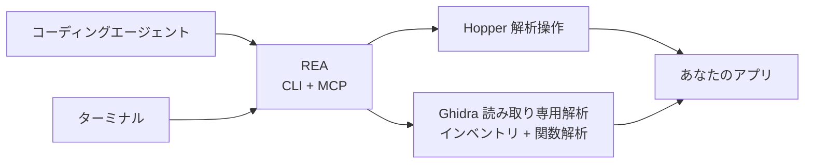

<div align="center">

[English](README.md) · [简体中文](README_zh.md) · **日本語** · [한국어](README_ko.md) · [العربية](README_ar.md)

# REA：あらゆるものをリバースエンジニアリング

### エージェントでアプリの動作からネイティブバイナリまで調べる。

**気になる機能を見つけ、仕組みを理解し、自分の形で実装する。**

[](https://www.npmjs.com/package/rea-agents)
[](https://github.com/morluto/rea/actions/workflows/ci.yml)
[](#調査ツールカタログ)
[](https://nodejs.org/)
[](LICENSE)
[](https://discord.gg/GkcryMnJDM)

<a href="https://trendshift.io/repositories/82054?utm_source=trendshift-badge&amp;utm_medium=badge&amp;utm_campaign=badge-trendshift-82054" target="_blank" rel="noopener noreferrer"></a>

[クイックスタート](#クイックスタート) · [現在の対応状況](#現在の対応状況) · [バイナリから動作へ](#バイナリから動作へ) · [調査ツールカタログ](#調査ツールカタログ) · [ロードマップ](#ロードマップ) · [仕組み](#仕組み)

<table aria-label="REA community">
<tr>
<td align="center" width="360">
  <a href="https://discord.gg/GkcryMnJDM">
    <br />
    <strong>リバースエンジニアリングのコミュニティに参加</strong>
  </a><br />
  <sub>Discord · 質問と回答 · 成果の共有</sub>
</td>
</tr>
</table>

<br />

<code>npx rea-agents setup</code>

<br />


</div>

---

アプリの機能を自分のプロダクトにも取り入れたいときは、REA を使ってエージェントに調査を依頼できます。ソースコードがなくても、アプリを調べ、仕組みと根拠を示し、あなたのプロジェクト向けに同様の機能を実装できます。

REA はネイティブバイナリ、JavaScript/Electron アプリ、.NET アセンブリ、Web サイトの解析ツールを提供します。エージェントからもターミナルからも使えます。解析はローカルで実行され、結果には根拠と制限が含まれます。

Setup はエージェントを設定し、既存の Hopper または Ghidra に接続します。承認後に Hopper をインストールすることもできます。

## エージェントに頼むだけ

[セットアップ](#クイックスタート)後にエージェントを再起動し、次のように依頼します：

```text
メモアプリの検索機能を調べて根拠を示し、私のプロジェクト向けに同様の機能を実装してください。
```

メモアプリを調べたいアプリに置き換えるか、まず概要を依頼してください。

## バイナリから動作へ

| 逆コンパイル                                                                                                                     | 理解                                                                                                                       | 再現                                                                                       |
| -------------------------------------------------------------------------------------------------------------------------------- | -------------------------------------------------------------------------------------------------------------------------- | ------------------------------------------------------------------------------------------ |
| ネイティブアプリや実行ファイルから、プロシージャ、疑似コード、アセンブリ、文字列、シンボル、セグメント、メタデータを復元します。 | 呼び出し元、呼び出し先、クロスリファレンス、コールグラフをたどり、機能やアルゴリズムの実際の動作を説明できる状態にします。 | エージェントが得た知見を、あなたの技術スタック、画面、要件に合うプロダクト機能へ変えます。 |

REA は調査をバイナリ上の根拠に結び付けます。元のソースコードを復元したり、アプリ全体を自動複製したりするとは主張しません。

## REA を選ぶ理由

|                        |                                                                                                      |
| ---------------------- | ---------------------------------------------------------------------------------------------------- |
| **エージェント向け**   | コンパイル済みアプリについて質問し、推測ではなく根拠を集めさせることができます。                     |
| **CLI と MCP**         | ターミナルとコーディングエージェントから同じリバースエンジニアリング機能を使えます。                 |
| **複雑さを処理**       | ツール設定、アプリの読み込み、調査の維持、終了後のクリーンアップを REA が担います。                  |
| **一連の調査に対応**   | 最初の概要から疑似コード、呼び出し関係、型、実装の手掛かりまで掘り下げられます。                     |
| **ローカルで解析**     | 解析は対応するローカルホストで実行され、REA がバイナリをホスト型解析サービスへ送ることはありません。 |
| **コンテキストを維持** | 質問ごとに解析を最初からやり直さず、複数のバイナリを続けて調査できます。                             |

## クイックスタート

### セットアップを実行（推奨）

REA をエージェントで使うための設定を行います：

```bash
npx rea-agents setup
```

Setup は最初に連携するエージェントを複数選択できるようにします。既存の REA 登録は初期選択されますが、検出されただけのクライアントは自動選択されず、未設定のクライアントも選べます。具体的なパスと変更内容を確認してから承認してください。選択したエージェントには通常 REA のワークフローをインストールします。Hopper は別の任意操作で、個別の承認が必要です。既存の Ghidra のパスも登録できます。

変更は事前に表示され、既存の設定はバックアップされます。要件と追加オプションは[インストールガイド](docs/installation.md)を参照してください。

### エージェントで使う

設定後にエージェントを再起動し、調べたいアプリや機能を説明します。REA は Claude Code、Claude Desktop、Codex、Cursor、Gemini CLI、Windsurf、Devin、OpenCode、Antigravity、GitHub Copilot CLI、Command Code、VS Code に対応します。既存の REA 登録は初期選択され、それ以外の検出済みクライアントは選択が必要です。その他のエージェントは下記の MCP 設定を使えます。

Hopper はデモモードで使えます。初回起動の画面ではデモを選択するか、既存のライセンスを入力してください。

### ターミナルで使う

設定後に実行します：

```bash
npx -y rea-agents@latest doctor
npx -y rea-agents@latest analyze /Applications/Notes.app
```

### rea コマンドをインストール

コマンドラインツールをインストールします：

```bash
curl -fsSL https://raw.githubusercontent.com/morluto/rea/main/install.sh | bash
```

Node.js と npm を先にインストールしてください。ターミナルで実行すると、インストーラーは `rea` を追加してセットアップを開始します。

npm でインストールし、セットアップを実行することもできます：

```bash
npm install --global rea-agents
rea setup
```

### 要件

- macOS 12 以降
- Ubuntu 24.04+、Fedora 41+、または 64 ビット Arch Linux
- Node.js 22.x (>=22.19)、24.x (>=24.11)、または 26+ と npm

ネイティブバイナリ解析には Hopper または Ghidra が必要です。Hopper は別製品です。デモにはベンダー所定の制限がありますが、有料ライセンスは必須ではありません。

Ghidra は Linux x64 と macOS x64/arm64 に対応します。Ghidra 12.1.4 と完全な 64 ビット JDK 21 を別途インストールし、REA で使うように設定してください。macOS ではホストのアーキテクチャに合うネイティブデコンパイラーも必要です。

Setup はインストールを確認し、パスを保存できます。Ghidra、Java、Node.js、npm、Homebrew のインストールや更新は行いません。

Windows の Ghidra 解析は利用できません。プロセスの所有権、プライベートディレクトリの権限、安全なパス検証が未実装のため、Ghidra と Java を正しくインストールしても有効になりません。[Windows Ghidra P0](docs/windows-ghidra-p0.md)を参照してください。

### トラブルシューティング

`npx -y rea-agents@latest doctor` はホスト、依存関係、解析ツール、エージェント設定を変更せずに確認します。構造化された診断には `--json` を追加してください。

Linux の既定ランチャーは `/opt/hopper/bin/Hopper` です。別の場所には `HOPPER_LAUNCHER_PATH` を設定します。ファイルがあるのに解析エンジンが見つからない場合は、`ldd /opt/hopper/bin/Hopper | grep 'not found'` で不足ライブラリを確認してください。詳しくは [Hopper ガイド](docs/installation.md#hopper)を参照してください。

### 更新とアンインストール

- `rea update` は現在の REA インストールを更新します。
- `rea uninstall` は REA が管理するエージェント登録とワークフローファイルを削除します。Hopper は残ります。
- `rea uninstall --purge-data` は REA のキャッシュと状態も削除します。それらを削除したい場合にだけ使ってください。

## 現在の対応状況

REA は CLI と MCP からネイティブバイナリ、JavaScript/Electron アプリ、.NET アセンブリ、Web サイトを解析できます。使える操作はホスト、対象、選択した解析ツールによって異なります。

- Hopper はネイティブ解析と注釈操作に対応します。GUI の動作はプラットフォームによって異なります。
- Ghidra は Linux x64 と macOS x64/arm64 で、一覧、検索、逆コンパイル、アセンブリ、呼び出し、参照、命令、型の検査など 22 の読み取り専用操作を提供します。GUI 操作や変更操作はありません。
- ブラウザー、Electron、プロセスの実行時ワークフローには、それぞれ設定、承認、終了処理の要件があります。詳細は [English README](README.md#current-status) を参照してください。
- Windows の Ghidra 解析は未対応です。進捗は [#527](https://github.com/morluto/rea/issues/527) で確認できます。

## ひとつのプロンプトで調査を完結

```text
メモアプリをリバースエンジニアリングし、オフライン検索機能の仕組みを説明して、
TypeScript と SQLite を使って私のプロジェクト向けに実装してください。
```

| 手順 | エージェントの処理             | REA ツール                                                       |
| ---: | ------------------------------ | ---------------------------------------------------------------- |
|    1 | バイナリを開いて識別           | `open_binary`, `binary_overview`                                 |
|    2 | オフライン検索の手掛かりを探す | `search_strings`, `search_procedures`, `list_names`              |
|    3 | 手掛かりと実行コードを接続     | `find_xrefs_to_name`, `xrefs`, `procedure_callers`               |
|    4 | 制御フローを復元               | `get_call_graph`, `procedure_callees`, `procedure_info`          |
|    5 | 関連する処理を逆コンパイル     | `procedure_pseudo_code`, `procedure_assembly`, `batch_decompile` |
|    6 | プロジェクトに機能を実装する   | 技術スタック、プロダクト、要件に合わせたコード                   |

REA は手順 1〜5 のバイナリ解析を処理し、手順 6 はエージェントの通常の編集・テストツールが行います。

## エージェントにできること

- ソースコードがない機能の仕組みを説明する。
- アプリの認証、保存、更新、ネットワークフローを復元する。
- 非公開の形式やインターフェースを文書化できる構造を回収する。
- 文字列やシンボルから疑わしい動作の実装コードまで追跡する。
- 同じセッションで 2 バージョンを切り替え、実装経路を比較する。
- 気になる機能を調査し、自分のプロダクトに合わせた形で実装する。
- 復元した動作をプロダクト機能、テスト、移行ノート、移植、相互運用できる代替実装へ変換する。
- Swift / Objective-C のメタデータを解析する。
- Hopper に名前、コメント、ブックマークを残し、人間とエージェントの調査を共有する。

## 調査ツールカタログ

| ツール分類           |  数 | 用途                                                                        |
| -------------------- | --: | --------------------------------------------------------------------------- |
| バイナリ検査         |  41 | 関数、疑似コード、アセンブリ、文字列、シンボル、参照、注釈                  |
| 組み合わせた解析     |  14 | 概要、関数解析、一括逆コンパイル、呼び出しグラフ、Swift と ObjC             |
| macOS ネイティブ     |   7 | Mach-O メタデータ、署名、plist、アーキテクチャ、Swift 名の復元              |
| ファイルとパッケージ |   5 | ディレクトリとパッケージ、Interface Builder、Apple リソース、抽出           |
| .NET PE/CLI          |   7 | アセンブリ識別、メタデータ、CIL、ネイティブ呼び出し、比較、再構築の取り込み |
| ブラウザー観察       |   9 | ページ、スクリプト、ソースマップ、WebMCP、スクリーンショット、比較          |
| Electron 解析        |   5 | ページ観察、アプリ構造、静的・実行時結果の対応付け                          |
| JavaScript 実行時    |   2 | 既存の Node/Electron Inspector に接続し、スクリプトと実行コンテキストを観察 |
| アプリのワークフロー |   7 | 機能追跡、バージョン比較、戻り値構造の比較、再実装の検証                    |
| バイナリセッション   |  21 | 対象切り替え、根拠の保存、プロセス・関数比較、未解決事項の記録              |

## ロードマップ

次の作業はネイティブ対象の検証拡大、JavaScript と .NET のバージョン比較、実行時の観察と再実装の検証です。Setup はエージェント連携と Hopper のインストールを選択できます。他の解析ツールのインストールは今後の作業です。[インストールのロードマップ](docs/roadmap.md)と[解析ツールの評価](docs/provider-evaluation.md)を参照してください。

## 他のコーディングエージェントで使う

Setup は Claude Code、Claude Desktop、Codex、Cursor、Gemini CLI、Windsurf、Devin、OpenCode、Antigravity、GitHub Copilot CLI、Command Code、VS Code に対応します。既存の REA 登録は初期選択され、それ以外の検出済みクライアントは選択が必要です。ローカル MCP サーバーに対応するエージェントは、次の設定でも接続できます。

<!-- x-release-please-start-version -->

```json
{
  "mcpServers": {
    "rea": {
      "command": "npx",
      "args": ["-y", "rea-agents@4.1.0", "mcp"]
    }
  }
}
```

<!-- x-release-please-end -->

## 仕組み



CLI と MCP サーバーは同じ解析処理を使います。ターミナルコマンドは完了後に自分のブリッジセッションを解放し、エージェントセッションは調査中の接続を維持できます。REA セッションを閉じても、ユーザーが利用中の Hopper は終了しません。

## CLI

上のエージェントワークフローが、REA を使う最も簡単な方法です。ターミナルから一度だけアプリの概要を調べる場合は、次を実行します。

```bash
npx -y rea-agents@latest analyze /Applications/Notes.app
```

直接デコンパイルする方法やその他のオプションは、`npx -y rea-agents@latest --help` で確認できます。

グローバルな `rea` コマンドとしてもインストールできます。

```bash
npm install --global rea-agents
rea --help
rea mcp
```

REA は Mac の `.app` フォルダーを直接開けます。エージェントがアプリを見つけられない場合は、インストール場所を伝えてください。

## Hopper アプリの動作

REA は必要なときに Hopper を起動します。Hopper のランチャーは内部でアプリをアクティブ化するため、ターゲットを開くと Hopper が前面に出る場合があります。REA はバックグラウンド起動を要求しますが、常に背面に留まる保証はありません。

明示的な形式・アーキテクチャ引数により一般的な FAT / ARM 選択ダイアログを避けますが、別の Hopper / macOS ダイアログは人の操作を必要とする場合があります。セッションを閉じるとブリッジとソケットを削除しますが、ユーザーが利用中の Hopper は終了しません。

## セキュリティモデル

各セッションはランダムな capability token と現在のユーザーだけが使える Unix ソケットを使用します。Ghidra セッションは隔離された一時プロジェクトも使用し、ユーザー所有の Ghidra プロジェクトを開いたり変更したりしません。これはサンドボックスではなく、同じ OS ユーザー権限で動作する悪意あるプロセスを防御しません。信頼できないバイナリの解析は、現在のユーザー権限で選択されたローカルプロバイダーに委譲されます。脆弱性は [SECURITY.md](SECURITY.md) の非公開手順で報告してください。

## FAQ

<details><summary><strong>Hopper を先に起動する必要がありますか？</strong></summary>

いいえ。REA が必要時に起動します。Hopper が起動済みでも使えますが、既存の GUI ドキュメントには接続せず、新しい解析ドキュメントを開きます。

</details>

<details><summary><strong>REA に Hopper は含まれますか？</strong></summary>

含まれません。Setup で Hopper をインストールできますが、Hopper は独自のライセンスを持つ別製品です。REA は CLI、MCP サーバー、エージェント向けワークフローを提供します。

</details>

<details><summary><strong>バイナリはアップロードされますか？</strong></summary>

REA にホスト型解析サービスはありません。ローカル Unix ソケット経由で Hopper を操作します。エージェントやモデル提供者のデータポリシーは別途確認してください。

</details>

<details><summary><strong>元のソースコードを復元できますか？</strong></summary>

保証できません。REA は疑似コード、アセンブリ、シンボル、文字列、メタデータ、関係を提供し、エージェントが観察した動作を説明または互換再現できるようにします。

</details>

## 開発

開発環境、アーキテクチャ、テスト、リリース手順は [CONTRIBUTING.md](CONTRIBUTING.md) を参照してください。

## ライセンス

[MIT](LICENSE)
