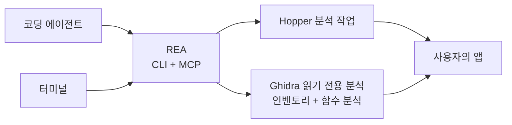

<div align="center">

[English](README.md) · [简体中文](README_zh.md) · [日本語](README_ja.md) · **한국어** · [العربية](README_ar.md)

# REA: 무엇이든 리버스 엔지니어링

### 에이전트로 앱의 동작부터 네이티브 바이너리까지 조사하세요.

**마음에 드는 기능을 찾고, 작동 방식을 이해하고, 원하는 방식으로 구현하세요.**

[](https://www.npmjs.com/package/rea-agents)
[](https://github.com/morluto/rea/actions/workflows/ci.yml)
[](#조사-도구-카탈로그)
[](https://nodejs.org/)
[](LICENSE)
[](https://discord.gg/GkcryMnJDM)

<a href="https://trendshift.io/repositories/82054?utm_source=trendshift-badge&amp;utm_medium=badge&amp;utm_campaign=badge-trendshift-82054" target="_blank" rel="noopener noreferrer"></a>

[빠른 시작](#빠른-시작) · [현재 지원 범위](#현재-지원-범위) · [바이너리에서 동작까지](#바이너리에서-동작까지) · [조사 도구 카탈로그](#조사-도구-카탈로그) · [로드맵](#로드맵) · [작동 방식](#작동-방식)

<table aria-label="REA community">
<tr>
<td align="center" width="360">
  <a href="https://discord.gg/GkcryMnJDM">
    <br />
    <strong>리버스 엔지니어링 커뮤니티에 참여하세요</strong>
  </a><br />
  <sub>Discord · 질문과 답변 · 작업 공유</sub>
</td>
</tr>
</table>

<br />

<code>npx rea-agents setup</code>

<br />


</div>

---

앱에서 마음에 드는 기능을 찾았다면 에이전트에게 REA로 조사해 달라고 요청하세요. 소스 코드가 없어도 앱을 분석하고, 기능의 동작과 근거를 설명한 뒤, 프로젝트에 맞는 기능을 구현할 수 있습니다.

REA는 네이티브 바이너리, JavaScript/Electron 앱, .NET 어셈블리, 웹사이트 분석 도구를 제공합니다. 에이전트와 터미널에서 같은 도구를 사용할 수 있습니다. 분석은 로컬에서 실행되며 결과에는 근거와 제한 사항이 포함됩니다.

Setup은 에이전트를 설정하고 기존 Hopper 또는 Ghidra 설치에 연결합니다. 승인 후 Hopper를 설치할 수도 있습니다.

## 에이전트에게 바로 요청하기

[설정](#빠른-시작)을 마친 뒤 에이전트를 다시 시작하고 요청하세요.

```text
메모 앱의 검색 기능이 어떻게 동작하는지 조사하고 근거를 보여 주세요.
그다음 제 프로젝트에 비슷한 기능을 구현해 주세요.
```

메모 앱 대신 조사할 앱을 지정하거나 먼저 개요를 요청할 수 있습니다.

## 바이너리에서 동작까지

| 디컴파일                                                                                                      | 이해                                                                                        | 재현                                                                                      |
| ------------------------------------------------------------------------------------------------------------- | ------------------------------------------------------------------------------------------- | ----------------------------------------------------------------------------------------- |
| 네이티브 앱이나 실행 파일에서 프로시저, 의사 코드, 어셈블리, 문자열, 심볼, 세그먼트, 메타데이터를 복구합니다. | 호출자, 피호출자, 상호 참조, 호출 그래프를 따라 기능이나 알고리즘의 실제 동작을 설명합니다. | 에이전트가 배운 내용을 사용자의 기술 스택, 화면, 요구 사항에 맞는 제품 기능으로 만듭니다. |

REA는 분석을 바이너리 증거에 근거하게 합니다. 원본 소스 코드를 복원하거나 앱 전체를 자동으로 복제한다고 주장하지 않습니다.

## REA를 사용하는 이유

|                    |                                                                                                     |
| ------------------ | --------------------------------------------------------------------------------------------------- |
| **에이전트용**     | 컴파일된 앱에 관해 질문하고 추측 대신 증거를 수집하게 합니다.                                       |
| **CLI와 MCP**      | 터미널과 코딩 에이전트에서 동일한 리버스 엔지니어링 기능을 사용합니다.                              |
| **복잡성 처리**    | 도구 설정, 앱 열기, 조사 유지, 작업 후 정리를 REA가 처리합니다.                                     |
| **전체 조사 과정** | 첫 개요에서 의사 코드, 호출 관계, 타입, 구현 단서까지 이어서 조사합니다.                            |
| **로컬 분석**      | 분석은 지원되는 로컬 호스트에서 실행되며 REA는 바이너리를 호스팅 분석 서비스에 업로드하지 않습니다. |
| **컨텍스트 유지**  | 질문마다 분석을 처음부터 시작하지 않고 여러 바이너리를 연속으로 조사합니다.                         |

## 빠른 시작

### 설정 실행하기(권장)

REA를 에이전트에 연결하세요.

```bash
npx rea-agents setup
```

Setup은 먼저 연결할 에이전트를 여러 개 선택하도록 안내합니다. 기존 REA 등록은 기본 선택되며, 감지만 된 클라이언트는 자동 선택되지 않습니다. 아직 설정되지 않은 클라이언트도 직접 선택할 수 있습니다. 정확한 경로와 변경 사항을 검토한 뒤 승인하세요. 선택한 에이전트에는 기본적으로 REA 워크플로가 설치됩니다. Hopper는 별도의 선택 사항이며 따로 승인해야 합니다. 기존 Ghidra 경로도 등록할 수 있습니다.

변경 전에 계획을 표시하고 기존 설정을 백업합니다. 요구 사항과 추가 옵션은 [설치 안내](docs/installation.md)를 참고하세요.

### 에이전트에서 사용하기

설정 후 에이전트를 다시 시작하고 조사할 앱이나 기능을 설명하세요. REA는 Claude Code, Claude Desktop, Codex, Cursor, Gemini CLI, Windsurf, Devin, OpenCode, Antigravity, GitHub Copilot CLI, Command Code, VS Code를 지원합니다. 기존 REA 등록은 기본 선택되고, 그 밖의 감지된 클라이언트는 직접 선택해야 합니다. 다른 에이전트는 아래 MCP 설정을 사용할 수 있습니다.

Hopper는 데모 모드로 사용할 수 있습니다. 첫 실행 안내가 나오면 데모를 선택하거나 기존 라이선스를 입력하세요.

### 터미널에서 실행하기

설정 후 실행하세요.

```bash
npx -y rea-agents@latest doctor
npx -y rea-agents@latest analyze /Applications/Notes.app
```

### rea 명령 설치하기

명령줄 도구를 설치하세요.

```bash
curl -fsSL https://raw.githubusercontent.com/morluto/rea/main/install.sh | bash
```

Node.js와 npm이 먼저 설치되어 있어야 합니다. 터미널에서 실행하면 설치 프로그램이 `rea`를 설치하고 설정을 시작합니다.

npm으로 설치한 뒤 설정을 실행할 수도 있습니다.

```bash
npm install --global rea-agents
rea setup
```

### 요구 사항

- macOS 12 이상
- Ubuntu 24.04+, Fedora 41+ 또는 64비트 Arch Linux
- Node.js 22.x (>=22.19), 24.x (>=24.11) 또는 26+와 npm

네이티브 바이너리 분석에는 Hopper 또는 Ghidra가 필요합니다. Hopper는 별도 소프트웨어입니다. 데모에는 공급업체의 제한이 있지만 유료 라이선스가 필수는 아닙니다.

Ghidra는 Linux x64와 macOS x64/arm64를 지원합니다. Ghidra 12.1.4와 완전한 64비트 JDK 21을 별도로 설치한 뒤 REA가 사용하도록 설정하세요. macOS에서는 호스트 아키텍처에 맞는 네이티브 디컴파일러도 필요합니다.

Setup은 설치를 확인하고 경로를 저장할 수 있습니다. Ghidra, Java, Node.js, npm, Homebrew를 설치하거나 업데이트하지 않습니다.

Windows Ghidra 분석은 사용할 수 없습니다. 프로세스 소유권, 비공개 디렉터리 권한, 안전한 경로 검사가 구현되지 않았으므로 Ghidra와 Java를 올바르게 설치해도 분석을 활성화할 수 없습니다. [Windows Ghidra P0](docs/windows-ghidra-p0.md)를 참고하세요.

### 문제 해결

`npx -y rea-agents@latest doctor`는 호스트, 의존성, 분석 도구, 에이전트 설정을 변경 없이 확인합니다. 구조화된 진단에는 `--json`을 추가하세요.

Linux의 기본 Hopper 실행 파일은 `/opt/hopper/bin/Hopper`입니다. 다른 위치에는 `HOPPER_LAUNCHER_PATH`를 설정하세요. 파일이 있는데도 분석 엔진이 없다고 하면 `ldd /opt/hopper/bin/Hopper | grep 'not found'`로 누락된 라이브러리를 확인하세요. 자세한 내용은 [Hopper 안내](docs/installation.md#hopper)를 참고하세요.

### 업데이트와 제거

- `rea update`는 현재 REA 설치를 업데이트합니다.
- `rea uninstall`은 REA가 관리하는 에이전트 등록과 워크플로 파일을 제거합니다. Hopper는 유지합니다.
- `rea uninstall --purge-data`는 REA 캐시와 상태도 삭제합니다. 해당 데이터를 지우려는 경우에만 사용하세요.

## 현재 지원 범위

REA는 CLI와 MCP로 네이티브 바이너리, JavaScript/Electron 앱, .NET 어셈블리, 웹사이트를 분석합니다. 사용할 수 있는 작업은 호스트, 대상, 선택한 분석 도구에 따라 다릅니다.

- Hopper는 네이티브 분석과 주석 작업을 지원합니다. GUI 동작은 플랫폼에 따라 다릅니다.
- Ghidra는 Linux x64와 macOS x64/arm64에서 목록, 검색, 디컴파일, 어셈블리, 호출, 참조, 명령어, 타입 검사 등 읽기 전용 작업 22개를 제공합니다. GUI나 변경 작업은 제공하지 않습니다.
- 브라우저, Electron, 프로세스 런타임 워크플로에는 각각 설정, 승인, 종료 처리 요구 사항이 있습니다. 자세한 내용은 [English README](README.md#current-status)를 참고하세요.
- Windows Ghidra 분석은 아직 사용할 수 없습니다. 진행 상황은 [#527](https://github.com/morluto/rea/issues/527)에서 확인하세요.

## 하나의 프롬프트로 전체 조사

```text
메모 앱을 리버스 엔지니어링해 오프라인 검색 기능의 작동 방식을 설명한 다음,
TypeScript와 SQLite를 사용해 제 프로젝트에 맞는 버전을 구현해 주세요.
```

| 단계 | 에이전트 작업           | REA 도구                                                         |
| ---: | ----------------------- | ---------------------------------------------------------------- |
|    1 | 바이너리 열기 및 식별   | `open_binary`, `binary_overview`                                 |
|    2 | 오프라인 검색 단서 찾기 | `search_strings`, `search_procedures`, `list_names`              |
|    3 | 단서를 실행 코드에 연결 | `find_xrefs_to_name`, `xrefs`, `procedure_callers`               |
|    4 | 제어 흐름 재구성        | `get_call_graph`, `procedure_callees`, `procedure_info`          |
|    5 | 관련 루틴 디컴파일      | `procedure_pseudo_code`, `procedure_assembly`, `batch_decompile` |
|    6 | 프로젝트에 기능 구현    | 기술 스택, 제품, 요구 사항에 맞는 코드                           |

REA는 1–5단계의 바이너리 분석을 처리합니다. 6단계는 에이전트가 일반 파일 편집 및 테스트 도구로 수행합니다.

## 에이전트가 할 수 있는 일

- 소스 코드가 없는 기능의 동작을 설명합니다.
- 앱의 인증, 저장소, 업데이트 또는 네트워크 흐름을 재구성합니다.
- 문서화되지 않은 형식이나 인터페이스의 구조를 복구합니다.
- 문자열이나 심볼에서 의심스러운 동작을 구현한 코드까지 추적합니다.
- 한 세션에서 두 앱 버전을 전환하며 구현 경로를 비교합니다.
- 마음에 드는 기능을 조사하고 자신의 제품에 맞는 버전으로 구현합니다.
- 복구한 동작을 제품 기능, 테스트, 마이그레이션 문서, 포팅 또는 상호 운용 가능한 대체품으로 변환합니다.
- Swift 및 Objective-C 메타데이터를 분석합니다.
- Hopper에 이름, 주석, 북마크를 남겨 사람과 에이전트의 분석을 연결합니다.

## 조사 도구 카탈로그

| 도구 분류         |  수 | 용도                                                                 |
| ----------------- | --: | -------------------------------------------------------------------- |
| 바이너리 검사     |  41 | 함수, 의사 코드, 어셈블리, 문자열, 심볼, 참조, 주석                  |
| 결합 분석         |  14 | 개요, 함수 분석, 일괄 디컴파일, 호출 그래프, Swift와 ObjC 검사       |
| macOS 네이티브    |   7 | Mach-O 메타데이터, 서명, plist, 아키텍처, Swift 이름 복원            |
| 파일과 패키지     |   5 | 디렉터리와 패키지 검사, Interface Builder, Apple 리소스, 추출        |
| .NET PE/CLI       |   7 | 어셈블리 식별, 메타데이터, CIL, 네이티브 호출, 비교, 재구성 가져오기 |
| 브라우저 관찰     |   9 | 페이지, 스크립트, 소스 맵, WebMCP, 스크린샷, 캡처 비교               |
| Electron 분석     |   5 | 페이지 관찰, 앱 구조, 정적·런타임 결과 연결                          |
| JavaScript 런타임 |   2 | 기존 Node/Electron Inspector에 연결해 스크립트와 실행 컨텍스트 관찰  |
| 앱 워크플로       |   7 | 기능 추적, 버전 비교, 반환 구조 비교, 재구현 검증                    |
| 바이너리 세션     |  21 | 대상 전환, 근거 저장, 프로세스·함수 비교, 미해결 항목 기록           |

## 로드맵

다음 작업은 네이티브 대상 검증 확대, JavaScript와 .NET의 버전 비교, 런타임 관찰과 재구현 검증입니다. Setup은 에이전트 연결과 Hopper 설치 선택을 이미 지원합니다. 다른 분석 도구 설치는 향후 작업입니다. [설치 로드맵](docs/roadmap.md)과 [분석 도구 평가](docs/provider-evaluation.md)를 참고하세요.

## 다른 코딩 에이전트에서 사용하기

Setup은 Claude Code, Claude Desktop, Codex, Cursor, Gemini CLI, Windsurf, Devin, OpenCode, Antigravity, GitHub Copilot CLI, Command Code, VS Code를 지원합니다. 기존 REA 등록은 기본 선택되고, 그 밖의 감지된 클라이언트는 직접 선택해야 합니다. 로컬 MCP 서버를 지원하는 에이전트는 다음 설정으로 연결할 수 있습니다.

<!-- x-release-please-start-version -->

```json
{
  "mcpServers": {
    "rea": {
      "command": "npx",
      "args": ["-y", "rea-agents@4.1.0", "mcp"]
    }
  }
}
```

<!-- x-release-please-end -->

## 작동 방식



CLI와 MCP 서버는 같은 분석 워크플로를 사용합니다. 터미널 명령은 완료 후 자신의 브리지 세션을 해제하고, 에이전트 세션은 조사 중 연결을 유지할 수 있습니다. REA 세션을 닫아도 사용자가 이용 중인 Hopper 앱은 종료하지 않습니다.

## CLI

위의 에이전트 워크플로가 REA를 사용하는 가장 쉬운 방법입니다. 터미널에서 앱을 한 번 빠르게 살펴보려면 다음을 실행하세요.

```bash
npx -y rea-agents@latest analyze /Applications/Notes.app
```

직접 디컴파일하는 방법과 기타 옵션은 `npx -y rea-agents@latest --help`에서 확인할 수 있습니다.

전역 `rea` 명령으로 설치할 수도 있습니다.

```bash
npm install --global rea-agents
rea --help
rea mcp
```

REA는 Mac의 `.app` 폴더를 직접 열 수 있습니다. 에이전트가 앱을 찾지 못하면 설치 위치를 알려 주세요.

## Hopper 앱 동작

REA는 필요할 때 Hopper를 시작합니다. Hopper 런처는 내부적으로 앱을 활성화하므로 대상을 열 때 Hopper가 다른 창 앞으로 나타날 수 있습니다. REA는 백그라운드 시작을 요청하지만 항상 뒤에 머무르는 것을 보장할 수 없습니다.

명시적인 형식과 아키텍처 인자로 일반적인 FAT/ARM 선택 대화상자를 피하지만, 다른 Hopper 또는 macOS 대화상자에는 사람이 응답해야 할 수 있습니다. 세션 종료 시 브리지와 소켓 디렉터리를 제거하지만 사용자가 작업 중인 Hopper 앱은 종료하지 않습니다.

## 보안 모델

각 세션은 무작위 capability token과 현재 사용자 전용 Unix 소켓을 사용합니다. Ghidra 세션은 격리된 임시 프로젝트도 사용하며 사용자 소유 Ghidra 프로젝트를 열거나 수정하지 않습니다. 이는 샌드박스가 아니며 같은 운영 체제 사용자로 실행되는 악성 프로세스를 방어하지 않습니다. 신뢰할 수 없는 바이너리를 열면 선택한 로컬 공급자가 현재 사용자 권한으로 분석합니다. 취약점은 [SECURITY.md](SECURITY.md)의 비공개 절차로 신고하세요.

## FAQ

<details><summary><strong>Hopper를 미리 실행해야 하나요?</strong></summary>

아니요. REA가 필요할 때 시작합니다. Hopper가 실행 중이어도 사용할 수 있지만 기존 GUI 문서에 연결하는 대신 새 분석 문서를 엽니다.

</details>

<details><summary><strong>REA에 Hopper가 포함되나요?</strong></summary>

아니요. Setup이 Hopper를 설치할 수 있지만 Hopper는 자체 라이선스가 필요한 별도 소프트웨어입니다. REA는 CLI, MCP 서버, 에이전트용 워크플로를 제공합니다.

</details>

<details><summary><strong>바이너리가 업로드되나요?</strong></summary>

REA에는 호스팅 분석 서비스가 없습니다. 로컬 Unix 소켓을 통해 Hopper를 조작합니다. 에이전트나 모델 공급자의 데이터 정책은 별도로 확인하세요.

</details>

<details><summary><strong>원본 소스 코드를 복구할 수 있나요?</strong></summary>

보장할 수 없습니다. REA는 의사 코드, 어셈블리, 심볼, 문자열, 메타데이터 및 관계를 제공하여 에이전트가 관찰된 동작을 설명하거나 호환되게 재현하도록 돕습니다.

</details>

## 개발

개발 환경, 아키텍처, 테스트, 릴리스 지침은 [CONTRIBUTING.md](CONTRIBUTING.md)를 참고하세요.

## 라이선스

[MIT](LICENSE)
