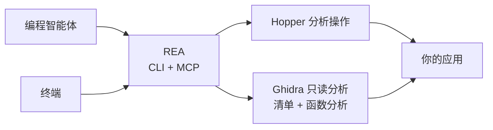

<div align="center">

[English](README.md) · **简体中文** · [日本語](README_ja.md) · [한국어](README_ko.md) · [العربية](README_ar.md)

# REA：逆向工程一切

### 使用智能体逆向工程任何程序，从应用行为到原生二进制文件。

**看到喜欢的功能。理解它的原理。按照你的方式实现。**

[](https://www.npmjs.com/package/rea-agents)
[](https://github.com/morluto/rea/actions/workflows/ci.yml)
[](#调查工具目录)
[](https://nodejs.org/)
[](LICENSE)
[](https://discord.gg/GkcryMnJDM)

<a href="https://trendshift.io/repositories/82054?utm_source=trendshift-badge&amp;utm_medium=badge&amp;utm_campaign=badge-trendshift-82054" target="_blank" rel="noopener noreferrer"></a>

[快速开始](#快速开始) · [当前状态](#当前状态) · [从二进制到行为](#从二进制到行为) · [调查工具目录](#调查工具目录) · [路线图](#路线图) · [工作原理](#工作原理)

<table aria-label="REA community">
<tr>
<td align="center" width="360">
  <a href="https://discord.gg/GkcryMnJDM">
    <br />
    <strong>加入逆向工程社区</strong>
  </a><br />
  <sub>Discord · 问答 · 成果分享</sub>
</td>
</tr>
</table>

<br />

<code>npx rea-agents setup</code>

<br />


</div>

---

看到某个应用中想加入自己产品的功能？让智能体用 REA 调查它。即使没有源代码，智能体也可以检查应用、解释功能的工作方式、展示证据，并为你的项目实现类似功能。

REA 提供原生二进制、JavaScript 与 Electron 应用、.NET 程序集和网站的分析工具。你可以从智能体或终端使用它们。分析在本机运行，结果会说明证据和限制。

Setup 可以配置智能体、连接已安装的 Hopper 或 Ghidra，也可以在你批准后安装 Hopper。

## 直接询问智能体

完成[设置](#快速开始)后，重启智能体并提出问题：

```text
解释“备忘录”应用的搜索功能，展示证据，然后为我的项目实现类似功能。
```

把“备忘录”替换成你想了解的应用，也可以先请求概览。

## 从二进制到行为

| 反编译                                                                       | 理解                                                                                   | 重建                                                         |
| ---------------------------------------------------------------------------- | -------------------------------------------------------------------------------------- | ------------------------------------------------------------ |
| 打开原生应用或可执行文件，恢复过程、伪代码、汇编、字符串、符号、段和元数据。 | 沿调用者、被调用者、交叉引用和调用图追踪，直到智能体能够解释功能或算法的实际工作方式。 | 将智能体学到的内容变成适合你的技术栈、界面和需求的产品功能。 |

REA 让调查始终以二进制证据为依据。它不会声称能恢复原始源代码，也不会自动克隆整个应用。

## 为什么选择 REA

|                  |                                                                      |
| ---------------- | -------------------------------------------------------------------- |
| **为智能体设计** | 直接询问编译后应用的行为，让智能体搜集证据，而不是猜测。             |
| **CLI 与 MCP**   | 在终端或编程智能体中使用同一套逆向工程能力。                         |
| **处理复杂流程** | REA 负责工具设置、打开应用、维持调查过程，并在完成后清理资源。       |
| **完整工作流**   | 从初步概览推进到伪代码、调用关系、类型和实现线索。                   |
| **本地运行**     | 分析在受支持的本机系统上运行；REA 不会把二进制上传到托管式分析服务。 |
| **保留上下文**   | 连续调查多个二进制文件，无需为每个问题重新开始整个分析过程。         |

## 快速开始

### 运行设置（推荐）

配置 REA 与智能体的连接：

```bash
npx rea-agents setup
```

Setup 首先让你多选要连接的智能体。已有 REA 注册默认选中；仅被检测到的客户端不会自动选中，也可以手动选择尚未配置的客户端。查看具体路径和变更后再批准。所选智能体默认安装 REA 工作流；Hopper 是单独的可选操作，需要单独批准。Setup 也可以记录现有 Ghidra 的路径。

Setup 会先展示变更并备份已有配置。要求与更多选项见[安装与设置](docs/installation.md)。

### 使用智能体

设置完成后，重启智能体并描述你想了解的应用或功能。REA 支持 Claude Code、Claude Desktop、Codex、Cursor、Gemini CLI、Windsurf、Devin、OpenCode、Antigravity、GitHub Copilot CLI、Command Code 和 VS Code。已有 REA 注册默认选中；其他检测到的客户端需手动选择。其他智能体可以使用下方的 MCP 配置。

Hopper 支持演示模式。如果首次启动时出现提示，选择演示模式或输入已有许可证。

### 从终端运行

设置完成后：

```bash
npx -y rea-agents@latest doctor
npx -y rea-agents@latest analyze /Applications/Notes.app
```

### 安装 rea 命令

安装命令行工具：

```bash
curl -fsSL https://raw.githubusercontent.com/morluto/rea/main/install.sh | bash
```

需要预先安装 Node.js 和 npm。在终端中运行时，安装程序会安装 `rea` 并启动设置。

也可以用 npm 安装，再运行设置：

```bash
npm install --global rea-agents
rea setup
```

### 运行要求

- macOS 12 或更高版本
- Ubuntu 24.04+、Fedora 41+ 或 64 位 Arch Linux
- Node.js 22.x (>=22.19)、24.x (>=24.11) 或 26+，以及 npm

原生二进制分析需要 Hopper 或 Ghidra。Hopper 是独立软件；演示模式有厂商规定的限制，不要求购买许可证。

Ghidra 支持 Linux x64 和 macOS x64/arm64。单独安装 Ghidra 12.1.4 和完整的 64 位 JDK 21，然后配置 REA 使用它们。macOS 还需要对应架构的原生反编译器。

Setup 可以验证安装并保存路径，不会安装或升级 Ghidra、Java、Node.js、npm 或 Homebrew。

Windows Ghidra 分析目前不可用。进程归属、私有目录权限和安全路径检查尚未实现，正确安装 Ghidra 和 Java 也不能启用分析。详见 [Windows Ghidra P0](docs/windows-ghidra-p0.md)。

### 故障排查

运行 `npx -y rea-agents@latest doctor`，检查主机、依赖、分析工具和智能体配置。该命令不会修改文件。添加 `--json` 可获取结构化诊断。

Linux 上的默认 Hopper 启动器为 `/opt/hopper/bin/Hopper`。其他路径可通过 `HOPPER_LAUNCHER_PATH` 指定。如果文件存在但仍报告缺少分析引擎，运行 `ldd /opt/hopper/bin/Hopper | grep 'not found'` 检查缺少的系统库。安装详情见 [Hopper 指南](docs/installation.md#hopper)。

### 更新与卸载

- `rea update` 更新当前 REA 安装。
- `rea uninstall` 移除 REA 管理的智能体配置项和工作流文件，保留 Hopper。
- `rea uninstall --purge-data` 还会删除 REA 的缓存和状态。仅在需要移除这些数据时使用。

## 当前状态

REA 可以通过 CLI 和 MCP 分析原生二进制、JavaScript/Electron 应用、.NET 程序集和网站。具体操作取决于主机、目标和所选分析工具。

- Hopper 支持原生分析和注释操作；GUI 行为取决于平台。
- Ghidra 在 Linux x64 和 macOS x64/arm64 上提供 22 项只读操作，包括清单、搜索、反编译、汇编、调用关系、引用、指令与类型检查。它不提供 GUI 或修改操作。
- 浏览器、Electron 和进程运行时工作流有独立的配置、批准和生命周期要求。详见 [English README](README.md#current-status) 中的完整状态说明。
- Windows Ghidra 分析尚未启用，跟踪进展见 [#527](https://github.com/morluto/rea/issues/527)。

## 一个提示词，完成一次完整调查

```text
逆向工程“备忘录”应用，找到离线搜索功能的工作方式，解释其控制流，
并使用 TypeScript 和 SQLite 为我的项目构建一个版本。
```

| 步骤 | 智能体的操作           | REA 工具                                                         |
| ---: | ---------------------- | ---------------------------------------------------------------- |
|    1 | 打开并识别二进制文件   | `open_binary`, `binary_overview`                                 |
|    2 | 搜索可能的离线搜索线索 | `search_strings`, `search_procedures`, `list_names`              |
|    3 | 将线索连接到可执行代码 | `find_xrefs_to_name`, `xrefs`, `procedure_callers`               |
|    4 | 重建相关控制流         | `get_call_graph`, `procedure_callees`, `procedure_info`          |
|    5 | 反编译相关程序         | `procedure_pseudo_code`, `procedure_assembly`, `batch_decompile` |
|    6 | 在你的项目中构建该功能 | 适合你的技术栈、产品和需求的代码                                 |

REA 负责第 1–5 步中的二进制分析。第 6 步由智能体使用其常规文件编辑与测试工具完成。

## 智能体可以完成什么

- 在没有源代码时解释某项功能的实现方式。
- 重建应用的身份验证、存储、更新或网络流程。
- 恢复足够的结构，以记录未公开的格式或接口。
- 从字符串或符号追踪到实现可疑行为的代码。
- 在一个会话中切换两个应用版本并比较实现路径。
- 调查你喜欢的功能，并为自己的产品构建量身定制的版本。
- 将恢复的行为转换为产品功能、测试、迁移说明、移植代码或互操作替代品。
- 分析 Swift 和 Objective-C 元数据。
- 在 Hopper 中留下名称、注释与书签，使人与智能体的分析互相增强。

## 调查工具目录

| 工具类别          | 数量 | 用途                                                      |
| ----------------- | ---: | --------------------------------------------------------- |
| 二进制检查        |   41 | 函数、伪代码、汇编、字符串、符号、段、引用与注释          |
| 组合分析          |   14 | 概览、函数分析、批量反编译、调用图、Swift 与 ObjC 检查    |
| macOS 原生工具    |    7 | Mach-O 元数据、代码签名、plist、架构与 Swift 符号还原     |
| 制品检查          |    5 | 目录与软件包检查、Interface Builder、Apple 资源目录与提取 |
| .NET PE/CLI       |    7 | 程序集身份、元数据、CIL、原生调用声明、成员比较与重建导入 |
| 浏览器观察        |    9 | 页面、脚本、来源映射、WebMCP 工具、截图与捕获比较         |
| Electron 分析     |    5 | 页面观察、应用结构与静态/运行时结果关联                   |
| JavaScript 运行时 |    2 | 连接现有 Node/Electron Inspector，观察脚本与执行上下文    |
| 应用工作流        |    7 | 功能追踪、版本比较、返回结构比较与重建验证                |
| 二进制会话        |   21 | 目标切换、证据包、进程与函数比较、待解决问题记录          |

## 路线图

接下来的工作包括更多原生目标验证、JavaScript 与 .NET 跨版本比较，以及运行时观察和重建验证。当前设置已支持选择智能体集成和 Hopper 安装；安装其他分析工具仍是后续工作。详见[安装路线图](docs/roadmap.md)和[分析工具评估](docs/provider-evaluation.md)。

## 与其他编程智能体一起使用

Setup 支持 Claude Code、Claude Desktop、Codex、Cursor、Gemini CLI、Windsurf、Devin、OpenCode、Antigravity、GitHub Copilot CLI、Command Code 和 VS Code。已有 REA 注册默认选中；其他检测到的客户端需手动选择。任何支持本地 MCP 服务器的智能体都可以使用以下配置连接 REA。

<!-- x-release-please-start-version -->

```json
{
  "mcpServers": {
    "rea": {
      "command": "npx",
      "args": ["-y", "rea-agents@4.1.0", "mcp"]
    }
  }
}
```

<!-- x-release-please-end -->

## 工作原理



CLI 与 MCP 服务器使用相同的分析流程。终端命令完成后释放自己创建的桥接会话；智能体会话可以在调查期间保持连接。关闭 REA 会话不会退出用户正在使用的 Hopper 应用。

## CLI

上面的智能体工作流是使用 REA 最简单的方式。如果只想在终端中快速了解一个应用：

```bash
npx -y rea-agents@latest analyze /Applications/Notes.app
```

运行 `npx -y rea-agents@latest --help` 查看直接反编译和其他选项。

也可以全局安装 `rea` 命令：

```bash
npm install --global rea-agents
rea --help
rea mcp
```

REA 可以直接打开 Mac 的 `.app` 文件夹。如果智能体找不到应用，请告诉它应用安装在哪里。

## Hopper 应用行为

REA 会在需要时启动 Hopper，无需预先运行。Hopper 启动器内部会激活应用，因此打开目标时 Hopper 可能出现在其他窗口前。REA 会请求 macOS 在后台启动 Hopper，但无法保证窗口始终位于后台。

REA 会推导明确的格式和架构参数，以避免常见的 FAT 与 ARM 选择对话框。其他 Hopper 或 macOS 对话框仍可能需要人工响应。关闭 REA 会话会终止桥并删除私有套接字目录，但不会退出用户正在使用的 Hopper 应用。

## 安全模型

每个桥会话都使用随机能力令牌和仅限当前用户的 Unix 套接字。诊断保留本机路径、摘要和错误位置等排查信息，同时移除凭据和认证令牌。Ghidra 会话还使用隔离的临时项目，不会打开或修改用户自己的 Ghidra 项目。

这不是沙箱，也无法防御以同一操作系统用户身份运行的恶意进程。打开不可信二进制文件会让所选本地提供商以当前用户权限进行解析和分析。请按照 [SECURITY.md](SECURITY.md) 中的私密流程报告漏洞。

## 常见问题

<details><summary><strong>Hopper 是否需要提前运行？</strong></summary>

不需要。REA 会在操作需要时启动 Hopper。Hopper 已经运行时也可以使用，但 REA 会打开新的分析文档，不会连接并复用现有 GUI 文档。

</details>

<details><summary><strong>REA 是否包含 Hopper？</strong></summary>

不包含。Setup 可以为你安装 Hopper，但 Hopper 仍是需要单独授权的软件。REA 提供 CLI、MCP 服务器和面向智能体的工作流。

</details>

<details><summary><strong>REA 会上传我的二进制文件吗？</strong></summary>

REA 不提供托管分析服务，而是通过本地 Unix 套接字把操作交给 Hopper。你的智能体或模型服务商可能有自己的数据政策，请单独核查。

</details>

<details><summary><strong>REA 能恢复原始源代码吗？</strong></summary>

不能保证。REA 提供伪代码、汇编、符号、字符串、元数据和关系，智能体可据此解释或兼容地重建观察到的行为。

</details>

## 开发

开发环境、架构、测试和发布说明请参阅 [CONTRIBUTING.md](CONTRIBUTING.md)。

## 许可证

[MIT](LICENSE)
